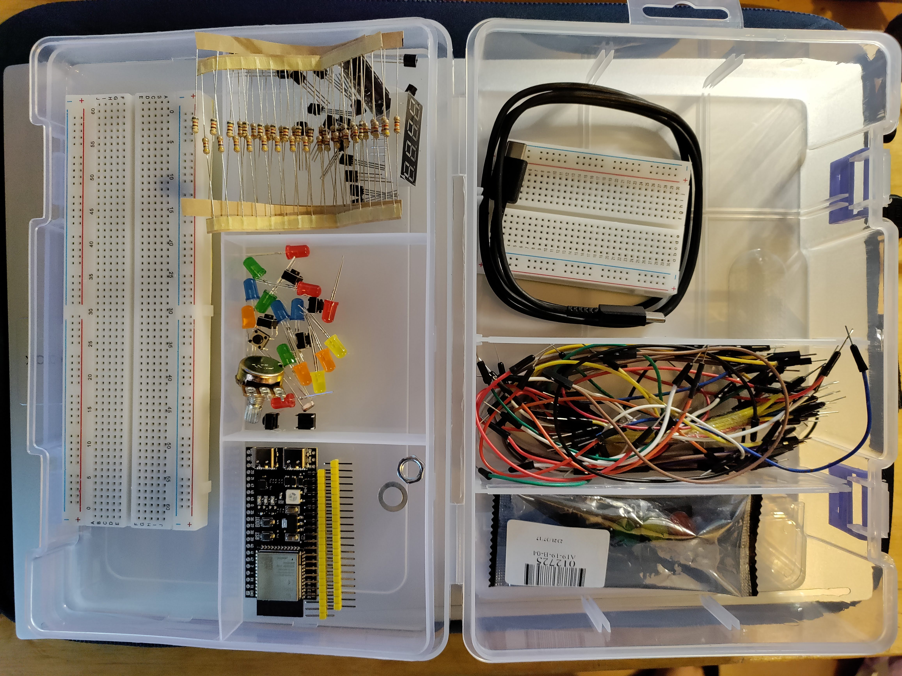

# Embedded Systems 1

## Simon Zweers, IT102
Dit is de git-repository waarin alle projectjes en programma's voor het vak "Embedded Systems 1" in staan. Het vak bestaat uit een praktisch en theoretisch deel. In deze repository word vooral het practisch deel (De projecten en programma's) gedocumenteerd met alle source-code.

### De embedded kit
We kopen allemaal een "Embedded Kit" die door docenten van de HvA samengesteld is.

Een lijst van alle onderdelen (Source: [Officieel Lesmateriaal](https://gitlab.fdmci.hva.nl/embedded-systems-1/lesmateriaal/-/blob/main/README.md#modal-confirm-fork-webide)).

|Onderdeel                       | Aantal |
|--------------------------------|--------|
| ESP32-S3-DevKitC-1             |   1x   |
| Plastic box container          |   1x   |
| Breadboard big                 |   1x   |
| Breadboard small               |   1x   |
| USB-C cable (1m)               |   1x   |
| Potentiometer (10K Ω)          |   1x   |
| Jumperwires                    |    -   |
| LEDs (red)                     |   3x   |
| LEDs (yellow)                  |   3x   |
| LEDs (blue)                    |   3x   |
| LEDs (orange)                  |   3x   |
| LEDs (green)                   |   3x   |
| Light-dependent resistor (LDR) |   1x   |
| Resistors (4.7K)               |  15x   |
| Resistors (820R)               |  15x   |
| Resistors (330R)               |  15x   |
| Transistors (2N3904)           |  16x   |
| LED bar (10 LEDs)              |   1x   |
| Traffic light 3 LED module)    |   1x   |
| 7 segment display (4 digits)   |   1x   |

Een Foto van de kit zoals hij er ongeveel uit zag: 

