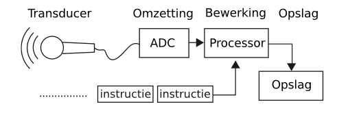
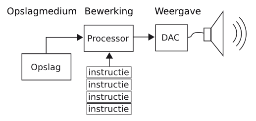
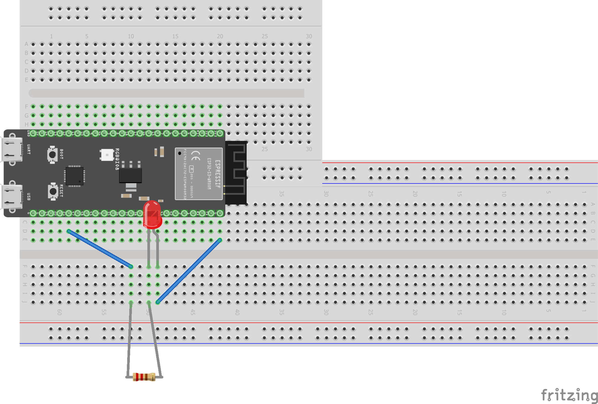
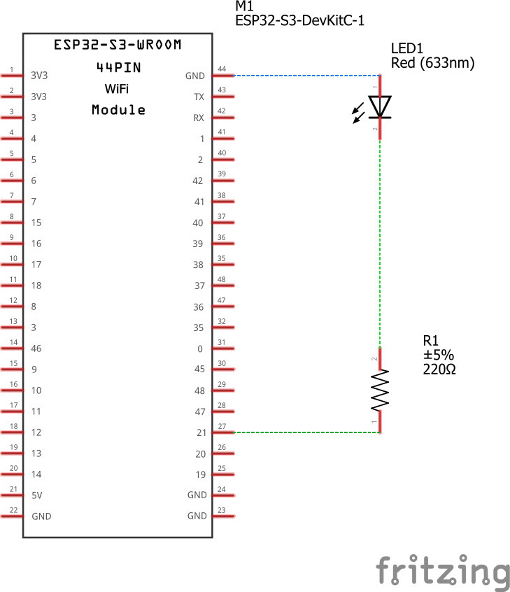
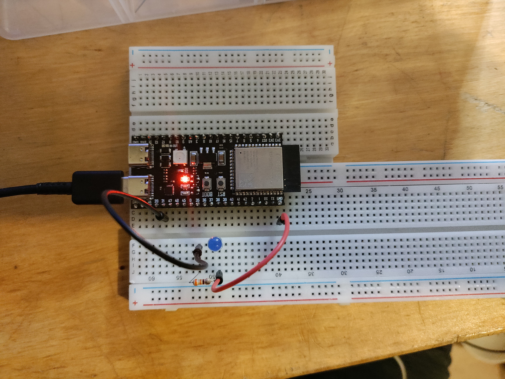

# Week 1

## Notities

CPU: Central Processing Unit. Voert alle instructies in een computer uit. Ook wel CVE (Cetrale VerwerkingsEenheid) genoemd.
Digitale gegevens:

- Eenvoudig op te slaan. Digitale gegevens kunnen op allerlei manieren zonder verlies opgeslagen worden voor archivering of latere bewerking.

- Complexe bewerkingen zijn mogelijk. Met een combinatie van veel eenvoudige instructies kunnen ingewikkelde bewerkingen op de gegevens worden uitgevoerd.

- Geen effecten van temperatuurdrift of componentveroudering, zoals die in analoge
technologie een rol speelt. De bewerkingen op digitale gegevens zijn op voorhand te analyseren en geven altijd dezelfde uitkomst.

- Verliesvrij transport over grote afstanden.

ADC (Analo-Digital Converter): Een analoog signaal word omgezet in een digitaal getal.

DAC (Digital-Analog Converter): Een digitaal getal word omgezet in een analoog signaal.

## Oefen Project Blinkie

### Een korte beschrijving van het project

Blinkie word in de embedded-systems wereld vaak gebruikt to introductie tot het vak. Het is een beetje de "Hello World!" van het embedded programmeren.

Het doel van het project was om een LED met een constant interval te laten knipperen.

Hier is het aansluitschema schematisch weergegeven:

Fritzing diagram             | Schematisch
-|-
 | 

Een foto van hoe je fysieke opstelling eruit ziet:

Als Laatst: [De code](./blinkie/src/main.c):

## Project Hartslag

### Een korte beschrijiving van het project

Het doel van het project is om een led te laten blinken in het patroon van een hartslag. Dit is een geavanceerdere versie van het oefenproject "Blinkie".

Sinds de aansluiting niet verschilt van Blinkie verwijs ik voor aansluitschema's en stroomkringen naar [Oefen Project Blinkie](#oefen-project-blinkie).

Bij Project Hartslag hoort deze code: [Hartslag](./hartslag/src/main.c).
