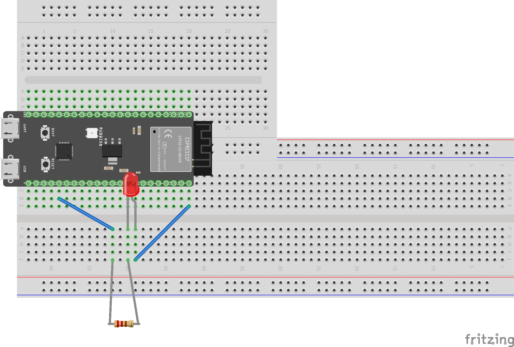

# Week 1

## OefenProject Blinkie

### Een korte beschrijving van het project

Blinkie word in de embedded-systems wereld vaak gebruikt to introductie tot het vak. Het is een beetje de "Hello World!" van het embedded programmeren.

Het doel van het project was om een LED met een constant interval te laten knipperen.

Hier is het aansluitschema schematisch weergegeven:


Een foto van hoe je fysieke opstelling eruit ziet:


Als Laatst: [De code](./blinkie/src/main.c):

```c
{
  "firstName": "John",
  "lastName": "Smith",
  "age": 25
}
```
