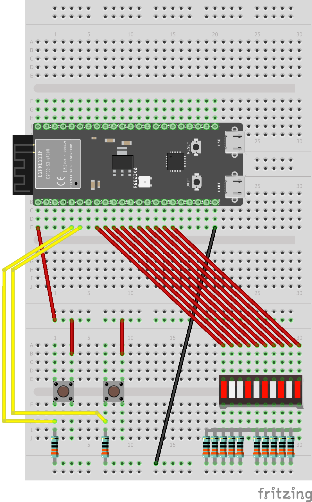
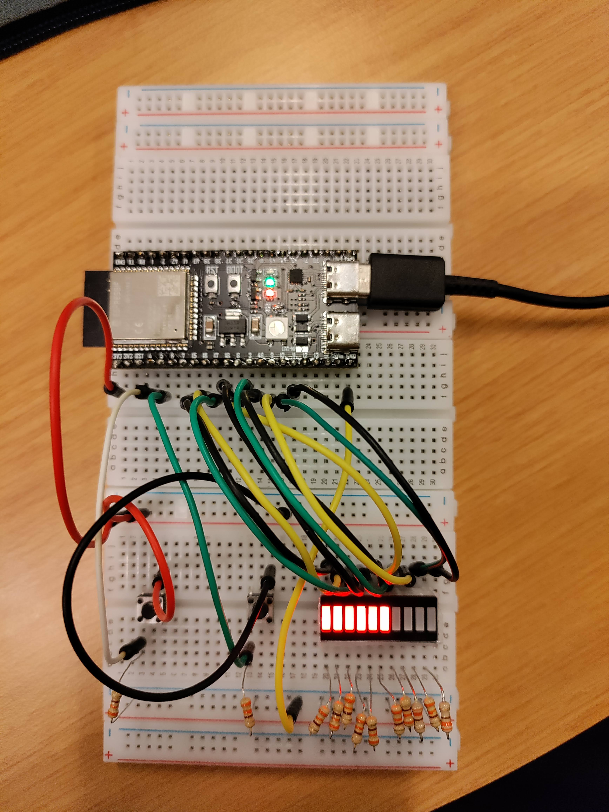

# Week 2

## Vraagstukken

### Talstelsels

Er zijn veel verschillende manieren om getallen uit te drukken.
Getallen kunnen uitgedrukt worden in verschillende talstelsels.
De vaakstgebruikte talstelsels zijn 10-tallig, hexadecimaal en binair.

### Binair talstelsel

Het binaire talstelser word door computers voor alles gebruikt.
In binair worden meer dingen dan getallen, zoals tekst, CPU instructies etc. uitgedrukt.

`Bit`: Een bit is een enkele 1 of 0.

`Byte`: Een groep van 8 bits.

`Nibble`: Een halve byte; een groep van 4 bits.

`Most/least significant bit`:
Most significant bit (MSB) wil zeggen dat een bit de hoogste waarde heeft.
De MSB staat aan de linker kant van een binair getal (2^n-1^).
Least significant bit (LSB) wil zeggen dat een bit de laagste waarde heeft.
De LSB staat aan de linker kant van een binair getal (2^0^).

### Reken grootheden

Normale voorvoegseltabel:
Voorvoegsel | IEC-voorvoegsel | Afkorting | IEC- afkorting| Tweemacht
-|-|-|-|-
Kilo    | Kibi | k of K | Ki | 2^10
Mega    | Mebi | M | Mi | 2^20
Giga    | Gibi | G | Gi | 2^30
Tera    | Tebi | T | Ti | 2^40
Peta    | Pebi | P | Pi | 2^50
Exa     | Exbi | E | Ei | 2^60
Zetta   | Zebi | Z | Zi | 2^70
Yotta   | Yobi | Y | Yi | 2^80

### Vertaaltabel met meerdere talstelsels

| Decimal | Binary   | Hexadecimal |
|---------|----------|-------------|
| 0       | 0000     | 0x0         |
| 1       | 0001     | 0x1         |
| 2       | 0010     | 0x2         |
| 3       | 0011     | 0x3         |
| 4       | 0100     | 0x4         |
| 5       | 0101     | 0x5         |
| 6       | 0110     | 0x6         |
| 7       | 0111     | 0x7         |
| 8       | 1000     | 0x8         |
| 9       | 1001     | 0x9         |
| 10      | 1010     | 0xA         |
| 11      | 1011     | 0xB         |
| 12      | 1100     | 0xC         |
| 13      | 1101     | 0xD         |
| 14      | 1110     | 0xE         |
| 15      | 1111     | 0xF         |

### 2's-complementcode

`2's-complementcode`:
2's complementcode is een veelgebruikte manier om negatieve nummers in het binair talstelsel weer te geven.
In 2's complement telt de MSB voor een negatief getal ipv een positief getal.
Bijv.:

`1010` in 2's comeplment is `-2` want de bit op plaats 4 heeft een waarde van `-8`.

## Led-bar tellen

Probleem: Je kan niet binair tellen. Oplossing: Je maakt een apparaat dat binair voor jou telt. Dit project zorgt ervoor dat binaire waardes om de seconde worden weergegeven op een led-bar.

### Hoe werkt het?

[Het programma](./led-bar-tellen/src/main.c) werkt door middel van 2 functies: `checkDigits()` en `setLedValues()`.

`checkDigits()` checkt 1 enkele bit van een getal ren geeft 1 terug als de bit op 1 staat en 0 als de bit op 0 staat. Dit wordt berekend door 2 operaties: bit shifting (`a << b`) en and-operaties (`a & b`). In deze functie wordt een binair getal gebitschift met een bepaalde hoeveelheid. Dat getal word dan vergeleken met het getal waarvan een digit gecheckt word. Als de uitkomst daarvan niet gelijk is aan nul betekend dat dat de digit op 1 staat, en dus geeft de functie 1 terug.

`setLedValues()` zet elke LED uit een array met GPIO pins aan of uit. Met de for-loop wordt voor elke LED met `gpio_set_level()` aan of uit. Hierin wordt dus de functie `checkDigits()` voor elke digit van het nummer gebruikt op te bepalen of de led aan of uit moet. Deze funcie word dan weer gebruikt in een for-loop om elk getal langs te gaan.

checkDigits Fuctie:

```c
int checkDigits (int numberToCheck, int index) {
    if (((1 << index) & numberToCheck) !=0 ) {
        return 1;
    } else {
        return 0;
    }    
}
```

setLedValues Functie:

```c
void setLedValues (int numberToConvert, int numOfDigits, int ledPinsArr[]) {
    for (size_t i = 0; i < numOfDigits; i++)
    {
        if (checkDigits(numberToConvert, i)) {
            printf("1");
            gpio_set_level(ledPinsArr[i], HIGH);
        } else {
            printf("0");
            gpio_set_level(ledPinsArr[i], LOW);
        }
    }
}
```

Shematische en fysieke foto's van het project:


## Hoeveel heb je op?

Dit project is meer geschikt voor de uitgaansmensen. Stel je voor je bent lekker uit met vrienden. Je hebt gezegd dat je maar een of twee biertjes gaat drinken, maar dat is uiteindelijk niet gelukt. Je bent nu alweer vergeten hoeveel je nou precies op had. Daar is dit project voor! Er zijn 2 knoppen: eentje voor als je een drankje wil toevoegen aan een teller, en eentje voor als je er een af wilt halen (Bijvoorbeeld als je een glas "water" hebt laten vallen). Het aantal gedronkgen glazen wordt weergegeven d.m.v een ledbar.

### Hoe werkt de het?

[Het programma](./led-bar-tellen/src/main.c) werkt door in een while-loop steeds voor nieuwe input te checken. De staat van beide knopjes worden uitgelezen met `gpio_get_level()`. Daarna worden de huidige (`getLevelLower` en `getLevelHigher`) en de vorige (`lowerCallback` en `higherCallback`) waarde van de knoppen vergeleken in een if-statement. Op basis daarvan word de teller verhoogd of verlaagd met 1. Als de teller lager dan 0 is dan word hij weer op 0 gezet. Daarna worden de ledjes aan- of uitgezet door de waarde van de teller.

### Schematisch en fysiek



