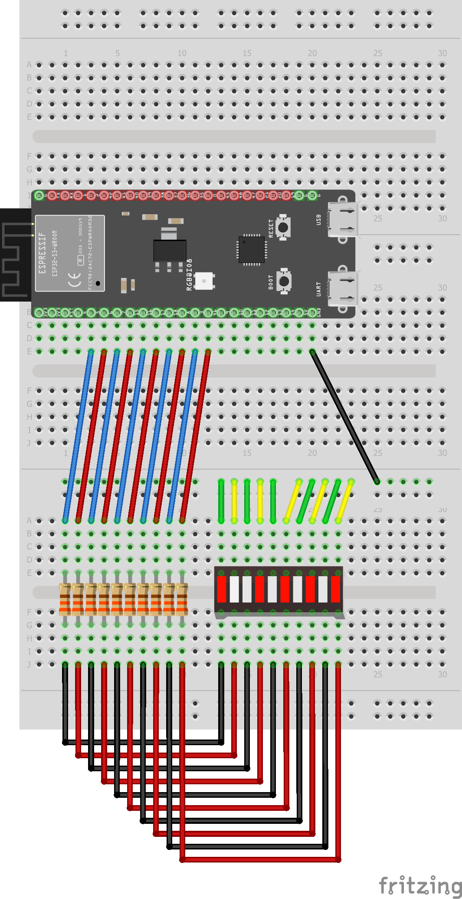

# Week 2

- [Week 2](#week-2)
  - [Vraagstukken](#vraagstukken)
    - [Talstelsels](#talstelsels)
    - [Binair talstelsel](#binair-talstelsel)
    - [Reken grootheden](#reken-grootheden)
    - [Vertaaltabel met meerdere talstelsels](#vertaaltabel-met-meerdere-talstelsels)
    - [2's-complementcode](#2s-complementcode)
    - [BCD](#bcd)
    - [ASCII en ISO 8859](#ascii-en-iso-8859)
    - [Logische niveaus](#logische-niveaus)
    - [Booleaanse algebra](#booleaanse-algebra)
    - [NOT gate](#not-gate)
    - [Tijdsdiagrammen en propogation delay](#tijdsdiagrammen-en-propogation-delay)
    - [Combinatorische schakelingen](#combinatorische-schakelingen)
    - [Geheugenschakelingen](#geheugenschakelingen)
    - [Fan-in Fan-out](#fan-in-fan-out)
    - [Flipflop schakelingen](#flipflop-schakelingen)
    - [Speciale uitgangen](#speciale-uitgangen)
  - [Led-bar tellen](#led-bar-tellen)
    - [Hoe werkt het?](#hoe-werkt-het)
    - [Shematisch en fysiek](#shematisch-en-fysiek)
  - [Hoeveel heb je op?](#hoeveel-heb-je-op)
    - [Hoe werkt de het?](#hoe-werkt-de-het)
    - [Schematisch en fysiek](#schematisch-en-fysiek)

## Vraagstukken

### Talstelsels

Er zijn veel verschillende manieren om getallen uit te drukken.
Getallen kunnen uitgedrukt worden in verschillende talstelsels.
De vaakstgebruikte talstelsels zijn 10-tallig, hexadecimaal en binair.

### Binair talstelsel

Het binaire talstelser word door computers voor alles gebruikt.
In binair worden meer dingen dan getallen, zoals tekst, CPU instructies etc. uitgedrukt.

`Bit`: Een bit is een enkele 1 of 0.

`Byte`: Een groep van 8 bits.

`Nibble`: Een halve byte; een groep van 4 bits.

`Most/least significant bit`:
Most significant bit (MSB) wil zeggen dat een bit de hoogste waarde heeft.
De MSB staat aan de linker kant van een binair getal (2<sup>n-1</sup>).
Least significant bit (LSB) wil zeggen dat een bit de laagste waarde heeft.
De LSB staat aan de linker kant van een binair getal (2<sup>0</sup>).

### Reken grootheden

Normale voorvoegseltabel:
Voorvoegsel | IEC-voorvoegsel | Afkorting | IEC- afkorting| Tweemacht
-|-|-|-|-
Kilo    | Kibi | k of K | Ki | 2<sup>10</sup>
Mega    | Mebi | M | Mi | 2<sup>20</sup>
Giga    | Gibi | G | Gi | 2<sup>30</sup>
Tera    | Tebi | T | Ti | 2<sup>40</sup>
Peta    | Pebi | P | Pi | 2<sup>50</sup>
Exa     | Exbi | E | Ei | 2<sup>60</sup>
Zetta   | Zebi | Z | Zi | 2<sup>70</sup>
Yotta   | Yobi | Y | Yi | 2<sup>80</sup>

### Vertaaltabel met meerdere talstelsels

| Decimal | Binary   | Hexadecimal |
|---------|----------|-------------|
| 0       | 0000     | 0x0         |
| 1       | 0001     | 0x1         |
| 2       | 0010     | 0x2         |
| 3       | 0011     | 0x3         |
| 4       | 0100     | 0x4         |
| 5       | 0101     | 0x5         |
| 6       | 0110     | 0x6         |
| 7       | 0111     | 0x7         |
| 8       | 1000     | 0x8         |
| 9       | 1001     | 0x9         |
| 10      | 1010     | 0xA         |
| 11      | 1011     | 0xB         |
| 12      | 1100     | 0xC         |
| 13      | 1101     | 0xD         |
| 14      | 1110     | 0xE         |
| 15      | 1111     | 0xF         |

### 2's-complementcode

`2's-complementcode`:
2's complementcode is een veelgebruikte manier om negatieve nummers in het binair talstelsel weer te geven.
In 2's complement telt de MSB voor een negatief getal ipv een positief getal.
Bijv.:

`1010` in 2's comeplment is `-2` want de bit op plaats 4 heeft een waarde van `-8`.

### BCD

`BCD`: Binary Coded Decimal.

Met BCD wordt een decimaal getal uitgedrukt in binaire waardes.
Elk decimaal nummer wordt apart in binair omgezet.  
Bijvoorbeeld:
`278 -> 0010 0111 1000`

### ASCII en ISO 8859

`ASCII`: American Standard Code for Information Exchange.

ASCII wordt gebruikt voor dataoverdracht in tekstvorm tussen computers.
ASCII beval naast letters, cijfers, leestekens etc. ook nog functiecodes.
Voorbeelden zijn: Backspace(positie terug), Line Feed(nieuwe regel) en Carriage return(naar begin van de regel).


`ISO 8859`: ISO 8859 is een overkoepelende term voor uitbreidingen van ASCII. ISO 8859 is dus een superset van ASCII. Zo kunnen bijvoorbeeld ook russische of griekse letters gecommuniceerd worden.

`Unicode`: Unicode is een veel grotere superset van ASCII.
Het doel van Unicode is om alle letters en tekens van ook maar elk alfabet/taal op te nemen.
Ook emoji's dus.
Unicode characters kunnen 1-4 bytes groot zijn.

### Logische niveaus

`Logisch niveau`: Simpelweg een binaire waarde.
Voorbeelden om een logisch niveau aan te duiden zijn:
High or Low, True or False, 1 of 0.

In TTL schakelingen zijn er spanningsdrempels die het logische niveau bepalen:
Niveau | Ingang | Uitgang
-|-|-
0 | V<sub>in</sub> $\leq$ 0,8V | V<sub>in</sub> $\leq$ 0,4V
1 | V<sub>in</sub> $\geq$ 2,0V | V<sub>in</sub> $\geq$ 2,4V

### Booleaanse algebra

`OR functie`: $F = A + B$

| A | B | F |
|-|-|----|
| 0 | 0 |   0 |
| 0 | 1 |   1 |
| 1 | 0 |   1 |
| 1 | 1 |   1 |

</img>

`AND functie`: $F = A \cdot B$

Truth table
|A|B|F|
|-|-|-------|
|0|0|   0   |
|0|1|   0   |
|1|0|   0   |
|1|1|   1   |

</img>

`NOT functie`: $F = \overline{A}$

### NOT gate

| A | F |
|---|----|
|  0 |   1 |
|  1 |   0 |

</img>

`NAND functie`: $F = \overline{A \cdot B}$

| A | B | F |
|-|-|-|
| 0 | 0 | 1 |
| 0 | 1 | 1 |
| 1 | 0 | 1 |
| 1 | 1 | 0 |

</img>

`NOR functie`: $F = \overline{A + B}$

| A | B | F |
|:-:|:-:|----:|
| 0 | 0 |   1 |
| 0 | 1 |   0 |
| 1 | 0 |   0 |
| 1 | 1 |   0 |

</img>

`EXOR functie`: $F = A \oplus B$

| A | B | F |
|:-:|:-:|----:|
| 0 | 0 |   0 |
| 0 | 1 |   1 |
| 1 | 0 |   1 |
| 1 | 1 |   0 |

</img>

### Tijdsdiagrammen en propogation delay

`Tijdsdiagram`: In een tijdsdiagram kun je de logische niveaus van een schakeling door de tijd noteren.  
`Positieve flank`: De overgang van logisch niveau 0 naar 1  
`Negatieve flank`: De overgang van logisch niveau 1 naar 0  
`Propogation delay`: Een flank is niet oneindig stijl.
Met propogation delay wordt de vertraging tussen het ingangsignaal en het uitgangssignaal bedoelt.
Meestal is de propogation delay voor 1 logische schakeling iets in de orde van nanoseconden.
Hoe meer logische schakelingen er in een combinatorische schakeling, hoe groter de propogation delay, want de propogation bouwt zich op met elke schakeling.  

### Combinatorische schakelingen

`Combinatoriesche schakelingen`: Hebben een of meer ingangen.
Produceren een resultaat in de vorm van logische niveaus.  
`Comparator`: Vergelijkt 2 getallen en kan 3 verschillende waardes geven:  
$A > B$  
$A = B$  
$A < B$  


`Multiplexer/demultiplexer`: Een multiplexer wordt ook wel een keuzeschakelaar genoemt.
Zorgt ervoor dat een van de ingangen doorgeschakelt wordt naar de uitgang.
Dit kan door de "select" ingangen.
Door veschillende waardes op de select ingangen te zetten kun je bepalen welk van de ingangen doorgecshakeld wordt.
Als je het signaal wil scheiden moet ja dat via een demultiplexer.
Door weer select uitgangen te gebruiken kun je weer bepalen naar welke uitgang het signaal doorgeschakeld wordt.  


### Geheugenschakelingen

`Geheugenschakelingen`: Kunnen bits onthouden.  
`Register`: Een reeks bijeen horende geheugenelementen


`Scguifregister`: Een register, maar dan met een shift-ingang.
Op de D<sub>0</sub> ingang kunnen bits gezet worden, die dan vervolgens met een LOAD-signaal geladen worden op het register.
Als er een signaal op de schift-ingang staat, dan schuiven alle bits 1 plaats op naar de uitgang.
In het schuifregister van de figuur hieronder is het 8 SHIFT-signalen om het volledige register te legen


`Flip-flop`: Een flip-flop is een logische schakeling die 1 bit kan onthouden.
Het is een geheugenelement voor 1 bit.
Er zijn veel verschillende soorten flipflops.

`Active-high`: Activeerd bij een positieve flank.

`Active-low`: Activeerd bij een negatieve flank.

`RS-flipflop`: Reset-Set flipflop heeft inganen S en R.
Als er een positieve flank staat op de S ingang, staat er op de C/Q


Een active low RS-flipflop is een normale RS-flipflop maar dan zijn de de signalen standaar hoog, en treed er verandering op bij een negatieve flank.  


`D-flipflop`: Een D-flipflop onthoudt het signaal om de D invoer bij een nieuwe klokpuls. Als er het signaal D 0 is tijdens een klokpuls, dan slaat de flipflop 0 op. Als D 1 is tijdens een klokpuls wordt 1 opgeslagen.


`JK-flipflop`: Een JK-flipflop heeft ook een klokingang, maar werkt iets anders dan een D-flipflop.
Er zijn 4 situaties mogelijk.  
$J = K = 0$ : Q veranderd niet na triggering  
$J = 1, K = 0$ : Q wordt (of blijft) 1  
$J = 1, K = 0$ : Q wordt (of blijft) 0  
$J = K = 1$ : Q wordt geïnverteerd na klokpuls


`JK-MS-flipflop`: Een JK-Master-Slave flipflop werkt hetzelfde als een normale JK-flipflop, maar dan is zit er een delay in tussen de ingangen en uitgangen.
Bij een positieve flank wordt het signaal opgeslagen in de master component.
Pas bij een negatieve flank wordt het signaal opgeslagen in de slave component.


`Synchrone ingang`: De J, K en D van de JK- en D-flipflops zijn synchrone ingangen.
Dit betekend dat ze afhanknelijk zijn van een klokpuls.

`Asynchrone ingang`: Asynchrone ingangen zijn inganken die niet afhankelijk zijn van een klokpuls.
Voorbeelden hiervan zijn eventuele "preset" en "clear" ingangen.
De preset ingang zet de flipflop op 1, de clear ingang op 0, afhankelijk afhankelijk van de klok.


`Data-latch`: De data-latch werkt hetzelfde als een D-flipflop, maar in plaats dat deze afhankelijk is van een klokpuls, is er een enable-ingang (E).
Als E getriggered wordt dan slaat de data-latch het signaal op de D-ingang op.


### Fan-in Fan-out

`Standaardbelasting`: Een gedefinieerde eenheid die aangeeft hoeveel inputs je op de output van een circuit kan aansluiten zonder een performancevermindering.  
`Fan-out`: Een term voor het aantal inputs dat je kan aansluiten op een output uitgedrukt in standaardbelasting.
Met een fan-out van 10 kan je 10 inputs aanstluiten zonder een drop in performance.  
`Fan-in`: Een term voor het aantal inputs dat een circuit aan kan uitgedrukt in standaardbelasting.
Met een fan-out van 4 kan een gate maximaal 4 inputs aan.  

### Flipflop schakelingen

`CRC-hardware`: Een schakeling om Cyclic-Redundancy-Checks te genereren en te controleren.
Als inputs zijn er een klok een een bitstroom.


Door de CRC-hardware een bitstroom aan te biedenmet 4 extra bits, genereer je voor die bitstroom een CRC van 4 bits.
Diezelfde checksum wordt gebruikt bij het checken van de bitstroom.
Dezelfde schakeling kan gebruikt worden voor verifiëren van de bitstroom.
Als de 4 toegevoegde bits weer opnieuw op `0000` uitkomen, dan is de inhoud van de data niet veranderd.


`Binary ripple counter`: Een "ripple counter" is een soort binaire teller die d.m.v. een kloksignaal zijn waarde verhoogt.
Dit maakt gebruikt van het feit dat als de J en K ingangen van een JK-MS-flipflop beide 1 zijn, de waarde op de uitgang "flipt".
Bij een ripple-counter staan de J en K ingangen dus op 1.


De naam "binary ripple counter" komt door het optreden van propogation delay.
Bij elke flipflop treed er meer propogation delay, vandeer het "ripple" effect.
Dit kun je zien in het tijdsdiagram.


`PRNG`: Een Psuedo Random Number Generator produceert een psuedo-willikeurig getal.
Psuedo willikeurig omdat het alsnog een logische schakeling is en dus een voorspelbare uitkomst heeft.
Het is dus geen echt "random" getal.
Het getal 0 komt niet voor, want dan blijft de PRNG alleen maar het getal 0 geven.
Dat komt door dat XOR-gate.
als alle flipflops met de waarde 0 beginnen herhaalt de operatie $0  \oplus 0$ zich, waar altijd 0 uitkomt.


### Speciale uitgangen

`Sperren`: Als de stroomkring breken.  
`Geleiden`: De stroomkring door laten lopen (geleiden).


`Kortsluiting`: Kortsluiting treed op wanneer een stroom door minder elektronische componenten gaat dan de bedoeling is.
Een voorbeeld is wanneer de pluspool van een accu zonder tussenstap is verbonden met de minpool.
Een ander voorbeeld is wanneer 2 uitgangen van logische schakelingen met een veschillend logisch niveau met elkaar verbonden worden.


## Led-bar tellen

Probleem: Je kan niet binair tellen. Oplossing: Je maakt een apparaat dat binair voor jou telt.
Dit project zorgt ervoor dat binaire waardes om de seconde worden weergegeven op een led-bar.

### Hoe werkt het?

[Het programma](./led-bar-tellen/src/main.c) werkt door middel van 2 functies: `checkDigits()` en `setLedValues()`.

`checkDigits()` checkt 1 enkele bit van een getal ren geeft 1 terug als de bit op 1 staat en 0 als de bit op 0 staat. Dit wordt berekend door 2 operaties: bit shifting (`a << b`) en and-operaties (`a & b`). In deze functie wordt een binair getal gebitschift met een bepaalde hoeveelheid. Dat getal word dan vergeleken met het getal waarvan een digit gecheckt word. Als de uitkomst daarvan niet gelijk is aan nul betekend dat dat de digit op 1 staat, en dus geeft de functie 1 terug.

`setLedValues()` zet elke LED uit een array met GPIO pins aan of uit. Met de for-loop wordt voor elke LED met `gpio_set_level()` aan of uit. Hierin wordt dus de functie `checkDigits()` voor elke digit van het nummer gebruikt op te bepalen of de led aan of uit moet. Deze funcie word dan weer gebruikt in een for-loop om elk getal langs te gaan.

checkDigits Fuctie:

```c
int checkDigits (int numberToCheck, int index) {
    if (((1 << index) & numberToCheck) !=0 ) {
        return 1;
    } else {
        return 0;
    }    
}
```

setLedValues Functie:

```c
void setLedValues (int numberToConvert, int numOfDigits, int ledPinsArr[]) {
    for (size_t i = 0; i < numOfDigits; i++)
    {
        if (checkDigits(numberToConvert, i)) {
            printf("1");
            gpio_set_level(ledPinsArr[i], HIGH);
        } else {
            printf("0");
            gpio_set_level(ledPinsArr[i], LOW);
        }
    }
}
```

### Shematisch en fysiek




## Hoeveel heb je op?

Dit project is meer geschikt voor de uitgaansmensen. Stel je voor je bent lekker uit met vrienden. Je hebt gezegd dat je maar een of twee biertjes gaat drinken, maar dat is uiteindelijk niet gelukt. Je bent nu alweer vergeten hoeveel je nou precies op had. Daar is dit project voor! Er zijn 2 knoppen: eentje voor als je een drankje wil toevoegen aan een teller, en eentje voor als je er een af wilt halen (Bijvoorbeeld als je een glas "water" hebt laten vallen). Het aantal gedronkgen glazen wordt weergegeven d.m.v een ledbar.

### Hoe werkt de het?

[Het programma](./led-bar-tellen/src/main.c) werkt door in een while-loop steeds voor nieuwe input te checken. De staat van beide knopjes worden uitgelezen met `gpio_get_level()`. Daarna worden de huidige (`getLevelLower` en `getLevelHigher`) en de vorige (`lowerCallback` en `higherCallback`) waarde van de knoppen vergeleken in een if-statement. Op basis daarvan word de teller verhoogd of verlaagd met 1. Als de teller lager dan 0 is dan word hij weer op 0 gezet. Daarna worden de ledjes aan- of uitgezet door de waarde van de teller.

### Schematisch en fysiek


