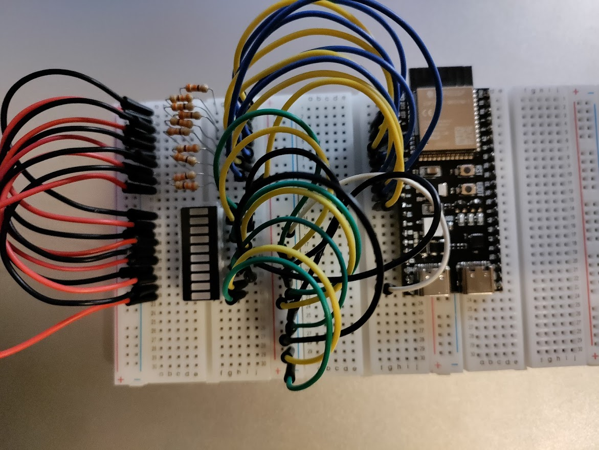

# Week 2

## Vraagstukken

### Wat is het verschil tussen een objectgeoriënteerde en een proceduregerichte taal?

### Wat is een crosscompiler?

Een crosscompiler is een programma dat op een systeem code compileert voor een ander systeem in plaats van de eigen processor.

### Wat is het verschil tussen interpreteren en compileren?

Interpreteren: Elke lijn van een programma word een voor een omgezet in instructies.
CompilerenL: Het hele programma word in 1 keer omgezet in instructies.

## 7 Segment Display

### Een beschrijving van het project

## Led-bar tellen

### een beschrijving van het project

Shematische en fysieke foto's van het project:

Schematisch | Foto
-|-
|
