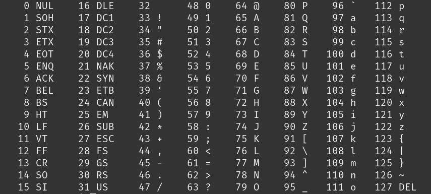

# Week 3

## Vraagstukken en theorie

### Voorvoegsels

Normale voorvoegsels:

Voorvoegsel | Afkorting | Tweemacht
-|-|-
Kilo | k of K | 2^10
Mega | M | 2^20
Giga | G | 2^30
Tera | T | 2^40
Peta | P | 2^50
Exa | E | 2^60
Zetta | Z | 2^70
Yotta | Y | 2^80

### Wat is het verschil tussen 1- en 2-complementnotatie?

### Hoe werken floating point getallen?

### BCD-code

BCD (Binary Coded Decimal) code word gebruikt om deciamle getallen 0-9 op te slaan als Binaire getallen 0-1. Voorbeeld 278 -> 0010(2) 0111(7) 1000(8).

### ASCII-code

Standaard ASCII (American Standard Code for Information Interchange) word gebruikt om dataoverdracht in tekstvorm tussen computers de standaardiseren. De eerste 32 bits (0-31) zijn functiecodes. Deze verschijnen niet op het scherm, maar zijn functies zoals Backspace of Line Feed (Nieuwe regel).

### ISO 8859

Karaktersetstandaarden

### Elementaire logische poorten

### Samengestelde logische poorten

Hoe maak je een EXOR logic gate?

### Don't care condities

Hoe weet je of iets een don't care conditie is?

### Propogation delay

Propagation delay is de vertraging tussen het ingangsignaal ten opzichte van het uigangsignaal.

### Fan-in, Fan-out en Standaarbelasting
