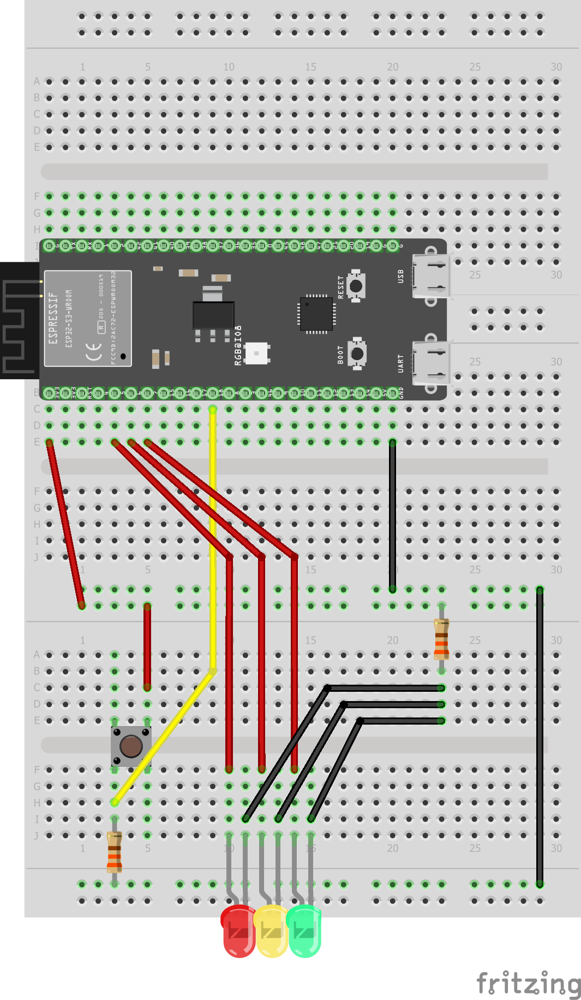

# Week 3

## Vraagstukken en theorie

### Voorvoegsels

Normale voorvoegsels:

Voorvoegsel | Afkorting | Tweemacht
-|-|-
Kilo | k of K | 2^10
Mega | M | 2^20
Giga | G | 2^30
Tera | T | 2^40
Peta | P | 2^50
Exa | E | 2^60
Zetta | Z | 2^70
Yotta | Y | 2^80

### Wat is het verschil tussen 1- en 2-complementnotatie?

### Hoe werken floating point getallen?

### BCD-code

BCD (Binary Coded Decimal) code word gebruikt om deciamle getallen 0-9 op te slaan als Binaire getallen 0-1. Voorbeeld 278 -> 0010(2) 0111(7) 1000(8).

### ASCII-code

Standaard ASCII (American Standard Code for Information Interchange) word gebruikt om dataoverdracht in tekstvorm tussen computers de standaardiseren. De eerste 32 bits (0-31) zijn functiecodes. Deze verschijnen niet op het scherm, maar zijn functies zoals Backspace of Line Feed (Nieuwe regel).


### ISO 8859

Karaktersetstandaarden

### Elementaire logische poorten

### Samengestelde logische poorten

Hoe maak je een EXOR logic gate?

### Don't care condities

Hoe weet je of iets een don't care conditie is?

### Propogation delay

Propagation delay is de vertraging tussen het ingangsignaal ten opzichte van het uigangsignaal.

### Fan-in, Fan-out en Standaarbelasting

### CRC

## Verkeerslicht

### Een korte beschijving van het project

Dit project is om een stoplicht-component net zoals een stoplicht te laten knipperen. De gebruiker drukt op een knop. Na een tijd gaat het stoplicht op groen. Daarna op oranje en weer op rood.

### Hoe werkt Verkeerslicht

[Het programma](verkeerslicht/src/main.c) werkt door een stoplichtcyclus te maken die niet onderbroken kan worden door op de knop te drukken. Eerst word gecheckt of de knop ingedrukt is door de huidige waarde `buttonValue` te vergelijken met de vorige waarde `buttonValueCallback`. Als de `buttonvalue` hoger is dan `buttonValueCallback`, dan wordt de functie `traffic_light_cycle()` gecallt.

```c
void traffic_light_cycle() {
    // GREEN
    vTaskDelay(TRAFFIC_DELAY_MS / portTICK_PERIOD_MS);
    set_one_to_high(GREEN, LED_PINS_ARR, ARRAY_LENGTH);
    printf("turned on GREEN\n");
    vTaskDelay(TRAFFIC_DELAY_MS / portTICK_PERIOD_MS);
    // YELLOW
    set_one_to_high(YELLOW, LED_PINS_ARR, ARRAY_LENGTH);
    printf("turned on YELLOW\n");
    vTaskDelay(TRAFFIC_DELAY_MS / portTICK_PERIOD_MS);
    // RED
    set_one_to_high(RED, LED_PINS_ARR, ARRAY_LENGTH);
    printf("turned on RED\n");
}
```

In deze functie wordt de functie `set_one_to_high()` gebruikt. Deze functie zet uit een array met leds 1 aan en de rest uit.

```c
void set_one_to_high(int pinToSet, int ledPinsArray[], int arrayLength) {
    for (size_t i = 0; i < arrayLength; i++)
    {
        if (pinToSet == ledPinsArray[i])
        {
            gpio_set_level(ledPinsArray[i], HIGH);
            printf("Set %d to HIGH\t", ledPinsArray[i]);
        } 
        else
        {
            gpio_set_level(ledPinsArray[i], LOW);
            printf("Set %d to LOW\t", ledPinsArray[i]);
        }   
    }
    printf("\n");
}
```

### Schematisch en fysiek




## PWM Verkeerslicht

### Een korte beschrijving van het project

### Hoe werkt Verkeerslicht-pwm

### SChematisch en fysiek

Dit project gebuikt dezelfde aansluiting als [verkeerslicht](#schematisch-en-fysiek)
