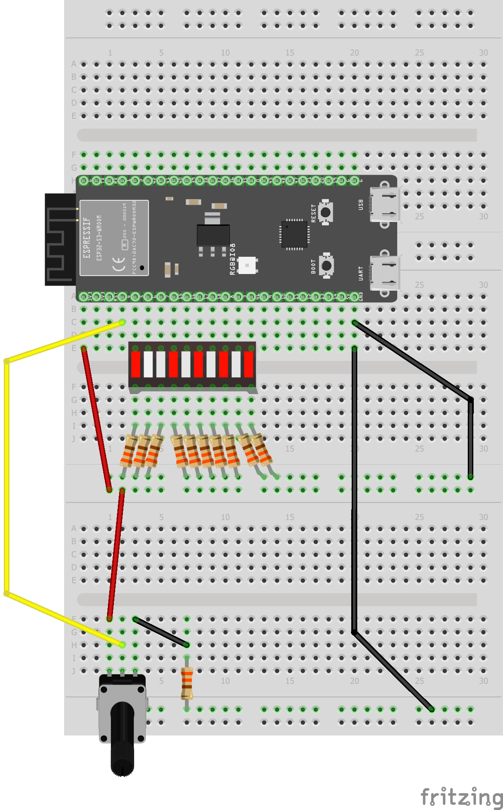
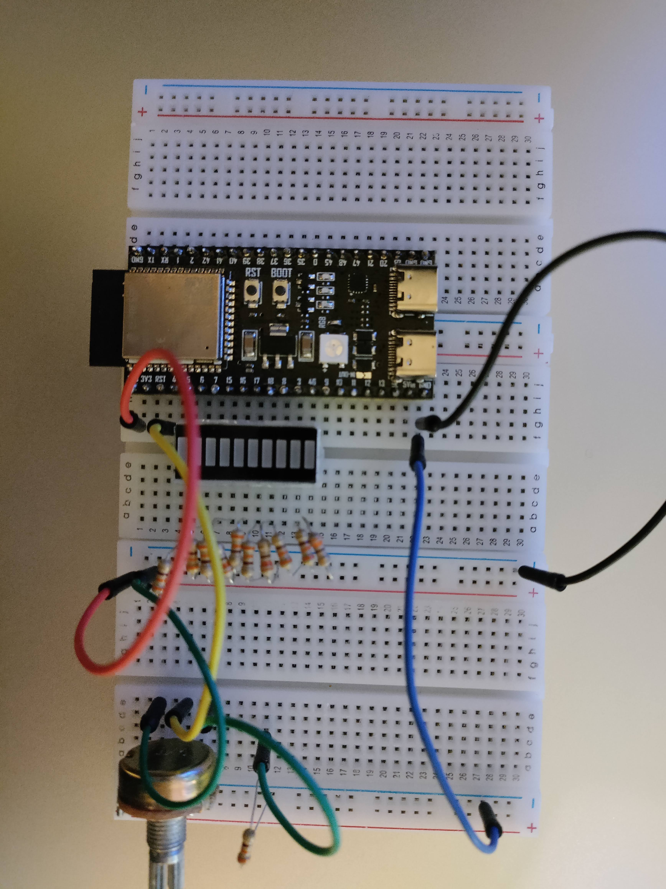

# Week 5

## Theorie / Vraagstukken

## Lightrider

In deze opdracht maak ik de verlichting van KITT uit Knight Rider (uit de jaren 80, dus daar ben ik te jong voor). De bedoeling is dat het knipperen sneller of langzamer kan worden dmv van een potentiometer.

### Hoe werkt het?

[Het programma](./light-rider/src/main.c) werkt door steeds 1 led aan en de rest uit te zetten. Ik heb de `checkDigits()` en de `setLedValues()` functie uit [project led bar tellen](../week2/led-bar-tellen/src/main.c) hergebruikt. De `setLedValues()` functie is iets aangepast om geen binair getal weer te geven maar een enkele led aan te doen. Het getal 1 word gebitshift met de index van de led die aan moet gaan, en zo word bepaald welke van de leds aan moet.

```c
void setLedValues (int numberToConvert, int numOfDigits, int ledPinsArr[]) {
    for (size_t i = 0; i < numOfDigits; i++)
    {
        if (checkDigits(1 << numberToConvert, i)) {
            printf("1");
            gpio_set_level(ledPinsArr[i], HIGH);
        } else {
            printf("0");
            gpio_set_level(ledPinsArr[i], LOW);
        }
    }
}
```

Er is ook een variabele die als teller dient (`ledOnValue`), Deze word met 2 for-loops 9 keer verhoogd en verlaagd. Met de waarde in de teller wordt de `setLedValues()` functie gebruikt om een led uit `ledPinsArray[]` aan te zetten. Na het verhogen van de teller wordt de signaal van de potentiometer uitgelezen naar `adc1Read`, en de loop wordt dan gedelayt op basis van de de waarde daarvan.

### Schematisch en fysiek



