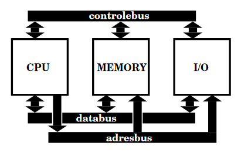
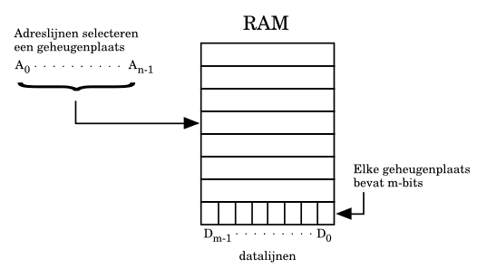
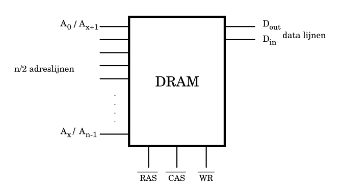
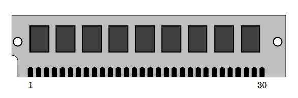
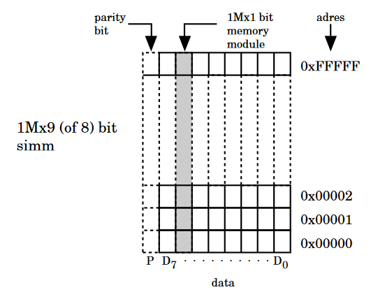
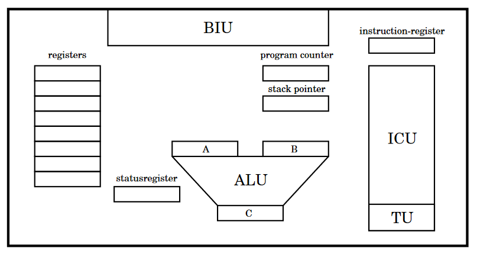
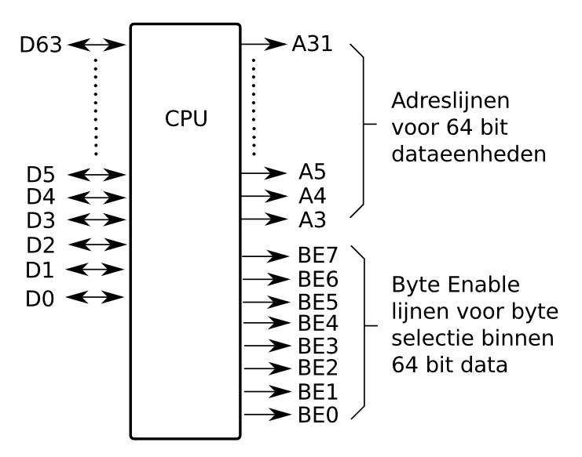

# Week 5

- [Week 5](#week-5)
  - [Theorie / Vraagstukken](#theorie--vraagstukken)
    - [Computerarchitectuur basis](#computerarchitectuur-basis)
    - [Geheugen](#geheugen)
    - [RAM en ROM](#ram-en-rom)
    - [CPU](#cpu)
    - [Von Neumann-cyclus](#von-neumann-cyclus)
    - [Instructieset](#instructieset)
    - [Stack pointer](#stack-pointer)
    - [Speciale CPU-registers](#speciale-cpu-registers)
    - [IO](#io)
    - [Exceptions](#exceptions)
  - [Lightrider](#lightrider)
    - [Hoe werkt het?](#hoe-werkt-het)
    - [Schematisch en fysiek](#schematisch-en-fysiek)

## Theorie / Vraagstukken

### Computerarchitectuur basis

`CPU`: De Central Processing Unit voert alle instructies in een computersysteem uit.
Na een instructie uitgevoerd te hebben slaat deze

`Bus`: Een bus is een connectie waarover data verzonden.

`Databus`: Over deze bus wordt data verzonden.

`Adresbus`: De data op deze bus bepaald op welk geheugenadres de data gelezen of geschreven wordt.



`Controlebus`: Op de controlebus staan veel verschillende soorten signalen.
Een voorbeeld ervan is het signaal dat aangeeft of er gelezen of geschreven wordt (ook wel de read-/writelijn).

`Busbreedte`Een bus heeft een bepaalde breedte.
Dit kan bijvoorbeeld 4, 8, 16, 32 of zelfs 128 bits zijn.
Als bijvoorbeeld de adresbus 16 bits breed is, kan de CPU $2^{16} = 65536$ unieke geheugenadressen aanspreken.

### Geheugen

`Geheugen`: Geheugen is er voor de CPU om instructies, en het resultaat van een instructie in op te slaan.
Onder geheugen versta je in de informatica meestal RAM.
SSD's en spinning disks vallen ook onder geheugen, maar deze zijn niet direct bereikbaar door de CPU (dit valt onder IO).

`Geheugencapaciteit`: Geheugencapaciteit beschrijft hoeveel bits een geheugenmodule kan opslaan.
Het totaal aantal bits wordt bepaald door het aantal bits op een geheugenadres en het aantal geheugenadressen te vermedigvuldigen.  
Het aantal adreslijnen op een geheugenmodule bepaald het aantal geheugenadressen.
Met de formule $2^n$ waarin $n$ het de breedte van de adresbus is.
De adres- en datalijnen van de geheugenmodule en CPU worden op elkaar aangesloten.



### RAM en ROM

`ROM`: ROM staat voor Read-only memmory.
Dit is geheugen waar alleen gelezen van wordt.
Er zijn verschillende soorten ROM-geheugen:  
ROM: Hierop wordt 1 keer door de fabrikant op geschreven en kan daarna niet meer veranderd worden.  
PROM: Programmable ROM;
Hierop kan 1 keer door de gebruiken op geschreven worden door de gebruiker.  
EPROM: Erasable Programmable ROM;
De inhoud kan met behulp van ultraviolet licht gewist worden, en daarna opnieuw geprogrammerd worden.  
EEPROM: Electronically Erasable Programmable ROM;
De inhoud kan gewist worden met een elektronisch signaal.
EEPROM wordt ook wel flashROM of flashmemory genoemd.

`RAM`: RAM staat voor Random Access memory.
RAM kan van gelezen worden en naartoe geschreven worden.
Er zijn ook verschillende soorten RAM:  
`SRAM`: Static RAM; SRAM behoud de data op de ram zolang de spanning op de voeding aanwezig blijft.  
`DRAM`: Dynamic RAM; verliest na een tijdje zijn data.
Meestal duurt dat in de praktijk rond de 2 ms.
De "refresh cycle" zorgt ervoor dat de RAM module zijn data niet permanent verliest.
Deze "refresh cycle" wordt uitgevoerd door de MMU.
Een DRAM module heeft vaan een opslagcapaciteit van 4 keer zo groot als de SRAM module.  
De adreslijnen van DRAM moeten gemultiplexed worden.
Eerst wordt de "row" van de module aangegeven.
Er wordt dan een signaal gegeven op de RAS (row address strobe) ingang.
Daarna wordt de "column" aangegeven.
Zo dan de CPU een bepaalde memory cell aanroepen.
Voor de "row" en "column" worden de zelfde adreslijnen gebruikt, vandaar het multiplexen.



`Simm`: Een simm is een printplaatje dat bestaat uit een aantal parallelgeschakelde DRAM modules.
De eerste simm's hadden 30 pins en zagen er schematisch ongeveer zo uit:



Zo ziet een simm er schematisch uit:



### CPU

Hier is een schematische weergave van de CPU:



`Byte-enable lijnen`: Veel CPU's kunnen op byte-niveau addresseren.
Dit betekend dat ondanks dat een CPU misschien een databus van 64 bits breed heeft, de CPU toch maar 1 of meerdere bytes kan lezen of schrijven.
Bijvoorbeeld voor als je een datatype van 2 bytes groot hebt.



`General-purpose registers`:
De CPU heeft allemaal general-purpose registers.
Deze registers worden voor allerlei verschillende acties gebruikt, bijvoorbeeld het optellen, bit-shiften etc.

`Program counter`:
Ook wel instruction pointer genoemd.
De program counter bevat het geheugenadres van de instrcutie die uitgevoerd moet worden.
Tijdens het uitvoeren wordt de inhoud van de program counter veranderd naar het adres van de volgende instructie die uitgevoerd moet worden.

`Stack pointer`:
Wijst naar het eerstvolgende vrije adres op de STACK (wordt later teogelicht bij [stack pointer](#stack-pointer)).

`Instructieregister`:
De CPU instructie die op het adres in de program counter staat wordt in het instructieregister geladen, om vervolgens uitgevoerd te worden door de CPU (ALU).

`TU`:
Timing unit.
Genereerd 1 of meerdere kloksignalen voor de interne logica van de CPU.

`ICU`:
Internal control unit.
Bestuurd het geheel van de CPU.
De ICU zorgt ervoor dat de timing signalen uit de TU netjes verdeeld worden, en dat het datatransport tussen registers binnen de CPU.
Het zorgt er dus voor dat CPU instructies uitgevoerd worden.

`ALU`:
Arithmetic Logic Unit.
De ALU is de rekenkracht van de CPU.
CPU instructies worden in de ALU uitgevoerd, en het resultaat daarvan wordt opgeslagen.
De ALU neemt 1 of 2 waardes data als input, en geeft naast een output ook statusinformatie die in het statusregister opgeslagen worden.

`Statusregister`:
De statusinformatie die de ALU na een instrucie oplevert wordt in het statusregister opgeslagen.
Deze informatie bestaat uit enkele bits die een eigen functie hebben.
Dit zijn van bits die bepaalde informatie weergeven:  
zero-bit: is 1 als de instructie 0 als resultaat heeft.  
carry-bit: is 1 als er een carry is bij de hoogste bits (MSB) van de twee getallen:
overflow-bit: is 1 als er bij een 2-complement bewerking overflow is opgetreden.  
De individuele bits worden "status flags" genoemd.

### Von Neumann-cyclus

`Von Neumann-cyclus`:
Verzamelnaam voor het ophalen en uitvoeren van 1 CPU instructie.
De Von Neumann-cyclus bestaat uit 4 stappen:

1. **Fetch**:
De inhoud van de program counter wordt op de adresbus gezet.
Er wordt een leessignaal op de controlebus gegeven.
De instructie op het geheugenadres wordt op de databus gezet.
De instructie wordt op het instructieregister gezet.
De inhoud van de program counter wordt bijgewerkt.

2. **Decode**:
De ICU decodeerd de instructies.
Er wordt gekeken naar de de instructie en de operands, zodat die doorgegeven kunnen worden aan de ALU.

3. **Execute**:
De instructie die door de ICU gedecordeerd is wordt uitgevoerd.

4. **Store**:
Het resultaat van de instructie wordt opgeslagen in een van de CPU registers.

### Instructieset

De instructies die de CPU uitvoert zijn eenen en nullen.
Dit wordt ook wel machinetaal genoemd.
Omdat machinetaal niet goed leesbaar is voor de mens, worden afkortingen toegekent aan elke instructie.
Deze afkortingen worden assemblertaal genoemt.

`Assemblertaal`: Programmeertaal die bestaat uit de afkoritingen van CPU-instructies.

`Little-endian`: De CPU leest eerst de lower byte.

`Big-endian`: De CPU leest eerste de higher byte

`Subroutine`: Een reeks processorinstructies die wordt aangeroepen met een bepaalde instructie.
Deze reeks staat op een andere plek dan de reeks instructies die de CPU aan't uitvoeren was.
Met een return-from-subroutine instructie keert het programma weer terug naar de instructies die de CPU aan het uitvoeren was.

Instructies zijn in een aantal groepen te categoriseren:

- Het laden van registers. Het opslaan van registers in geheugen.
- Rekeninstructies: optellen, aftrekker, verhogen-/verlagen met 1, vermenigvuldigen, delen, shiften.
- Logische operators: AND, OR, EXOR, NOT, en testen van bits.
- Spronginstructies: absolute en relatieve sprongen. Contitional/unconditional.
- Subroutine aanroep/return from subroutine: Het aanroepen van een stukje geheugen met instructies. Om weer terug te komen na de subroutine.
- Speciale instructies: NOP(no-operation), HALT(stop), instructies die de mode van een CPU kunnen veranderen.

### Stack pointer

De stack pointer is een speciaal register in de CPU.
De Stack pointer bevat het geheugenadres van het eerstvolgende vrije geheugenadres van de Stack.

`Stack`:
De stack is een stuk geheugen waarop geheugenadressen worden opgeslagen.
Deze deze geheugenadressen wijzen naar instructies waar de CPU na een subroutine terug naar moet keren.
De geheugenadressen worden een voor een weer geladen in de Program counter zodat de CPU met deze instrucie verder gaat.

`Subroutine`:
Een reeks processorinstructies die wordt aangeroepen met een bepaalde instructie.
Deze reeks staat op een andere plek dan de reeks instructies die de CPU aan't uitvoeren was.
Met een return-from-subroutine instructie keert het programma weer terug naar de instructies die de CPU aan het uitvoeren was.

### Speciale CPU-registers

`Indexregister`:
Slaat het adres van een reeks bijbehorende data (bijvoorbeeld een array) op.
Als je een array hebt, kun je met het indexregister een bepaalde waarde uit de array benaderen.

`Loopcount`:
Functioneert als teller bij het uitvoeren van herhalingen.

`Framepointer`:
Hogere level programmeertalen gebruiken dit register om bij te houden in welke subroutine een proces zit.

### IO

`Memory mapped IO`:
Meest gebruikte vorm van IO.
De CPU kan memory mapped IO op in het RAM zetten.
De CPU kan dus communiceren met peripherals door het RAM te gebruiken.
Memory-mapped IO gebruikt de normale CPU-instructies.  
Een paar voordelen van memory mapped IO zijn:

- Dezelfde instructies kunnen voor RAM en IO gebruikt worden.
- Het is mogelijk voor heel veel CPU's om zo te communiceren met IO.

Een aantal nadelen kunnen zijn:

- IO neemt geheugenadressen in beslag. Vooral nadelig voor CPU's met een kleine adresbus.
- Het selecteren van een IO poort werkt hetzelfde als het selecteren van andere adressen. Dit maakt het selecteren van IO poorten iets ingewikkelder.

`Speciale IO`:
Dit geheugen is met speciale instructies aan te spreken voor IO.
Deze instructies kunnen speciaal geheugen adresseren.
De CPU communiceert met de peripherals door speciale poorten of hardware interfaces.
Wordt vaak gebruikt voor situaties waar snelle communicatie tussen de CPU en de IO nodig is.

### Exceptions

Bij een exception zet zet de CPU de waardes van de registers op de stack. Daarna word naar een geheugenplaats gesprongen waar de exception handler staat.

Er zijn verschillende soorten exceptions:

- Hardware interrupts: Signalen van buitenaf, bijvoorbeeld uit IO.
- Interne exceptions die voorkomen bij het afhandelen van een instructie. Een voorbeeld is delen door 0, of een niet-bestaande instructie, wat ook wel een "trap" genoemd word.
- Software interrupt: Zelfde effect als een hardware interrupt. Wordt vanuit de software aangeroepen.

`Hardware interrupt`:
Een hardware interrupt is een signaal dat wordt gezet op de controlebus zodat de CPU het kan lezen.
Meestal is het IO die werk heeft voor de CPU, bijvoorbeeld als er een input klaar staat, bijvoorbeeld een binnengekomen package over internet.
In het geval van internet is de netwerkinterface verantwoordelijk voor het geven van de interrupt.
Zo reageert de CPU meestal op een interrupt:

- Zet de waardes van alle registers, program counter en statusregister op de stack.
- Laad de program counter met het adres van de geheugenplek van de ISR en ga deze uitvoeren. De ISR wordt afgesloten met een RTI(return from interrupt) instructie.

`ISR`:
Interrup Service Routine.
Een stuk code deat uitgevoerd word als de CPU een bepaalde interrupt krijgt.
De ISR is altijd op een vast geheugenadres te vinden.

`Non-maskable interrupt`:
De CPU kan sommige interrupts negeren.
Non-maskable interrupts kunnen niet genegeert worden door de CPU.
Deze wordt in noodsituaties, zoals falende hardware of wegvallende spanning gebruikt.

## Lightrider

In deze opdracht maak ik de verlichting van KITT uit Knight Rider (uit de jaren 80, dus daar ben ik te jong voor). De bedoeling is dat het knipperen sneller of langzamer kan worden dmv van een potentiometer.

### Hoe werkt het?

[Het programma](./light-rider/src/main.c) werkt door steeds 1 led aan en de rest uit te zetten. Ik heb de `checkDigits()` en de `setLedValues()` functie uit [project led bar tellen](../week2/led-bar-tellen/src/main.c) hergebruikt. De `setLedValues()` functie is iets aangepast om geen binair getal weer te geven maar een enkele led aan te doen. Het getal 1 word gebitshift met de index van de led die aan moet gaan, en zo word bepaald welke van de leds aan moet.

```c
void setLedValues (int numberToConvert, int numOfDigits, int ledPinsArr[]) {
    for (size_t i = 0; i < numOfDigits; i++)
    {
        if (checkDigits(1 << numberToConvert, i)) {
            printf("1");
            gpio_set_level(ledPinsArr[i], HIGH);
        } else {
            printf("0");
            gpio_set_level(ledPinsArr[i], LOW);
        }
    }
}
```

Er is ook een variabele die als teller dient (`ledOnValue`), Deze word met 2 for-loops 9 keer verhoogd en verlaagd. Met de waarde in de teller wordt de `setLedValues()` functie gebruikt om een led uit `ledPinsArray[]` aan te zetten. Na het verhogen van de teller wordt de signaal van de potentiometer uitgelezen naar `adc1Read`, en de loop wordt dan gedelayt op basis van de de waarde daarvan.

### Schematisch en fysiek


