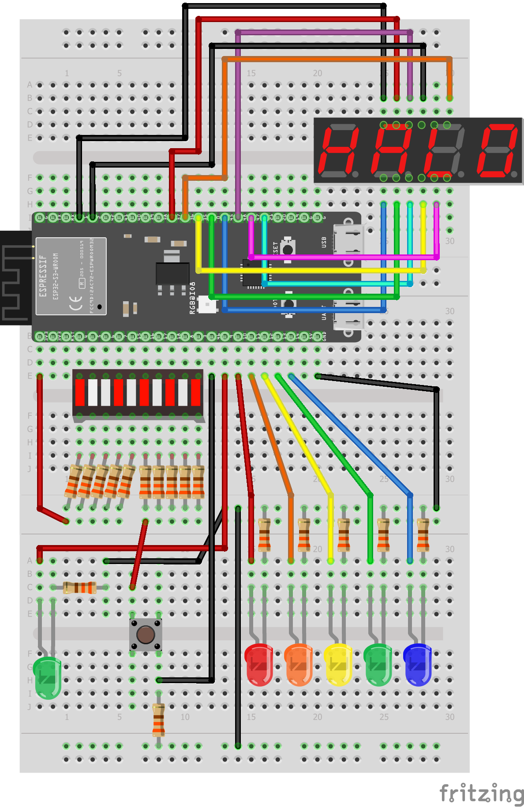
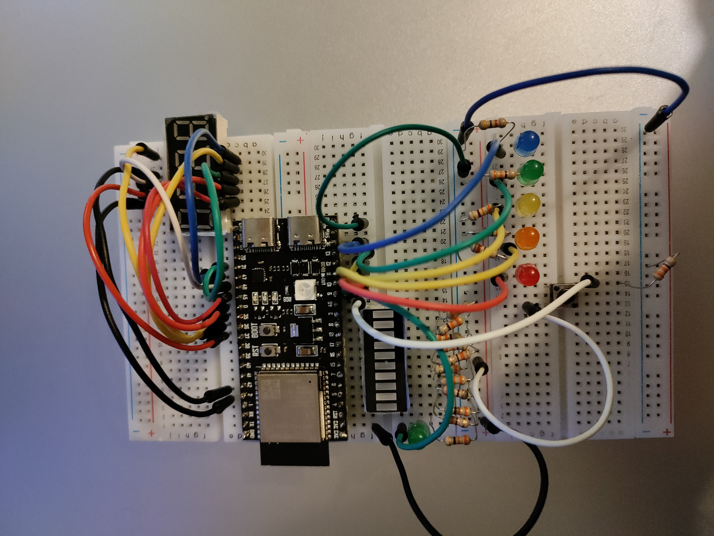

# Week 6

## Vraagstukken en Theorie

## Eindopdracht

### Een korte beschrijving van het project

Er zijn was keuze uit 3 verschillende eindopdrachten; Led Choreografie, Pong en Weerstation.
Ik heb pong gekozen.
De opdracht was om een spel te maken dat een beetje lijkt op pong.
Over de 10 leds van de LEDbar beweegt heen en weer een oplichtende led.
Als de led aan het eind is van zijn cyclus, gaat er een led aan.
Dit signaleerd het moment om op de knop te drukken.
Als je te laat of te vroeg bent wordt er een punt van je levens afgetrokken.
Je hebt in totaal 5 levens.
Het spel wordt steeds moeilijker.
De score van van de speler wordt weergegeven op een 7-segment display.
De speler kan voor het spel begint zijn naam invoeren in een seriële monitor.
Als alle levens op zijn, stopt het spel en kan een nieuwe speler zijn naam invoeren.

### Instructies

Hieronder volgt een korte lijst met instructies om het spel te spelen:

1. Open een seriële monitor op voor de esp met een baudrate van 115200
2. Voer je naam in via het toetsenbord en druk op ENTER als je klaar bent.
3. Druk op de knop om het spel te starten.
4. Wacht tot dat de groene led naast de LEDbar aan gaat. Wanneer de led op groen gaat druk je op de knop. Als je te laat of te vroeg klikt, verlies je een leven.
5. Het spel wordt steeds moeilijker, dus blijf spelen totdat je levens op zijn en probeer een highscore te krijgen!

### Hoe het werkt

[Het programma](./pong/src/main.c)

Seven-segment display:
Op de 7 segment display is de huidige score van de speler te laten zien.
Met de SevSeg library (origineel door Dean Reading en geupdate door Mats Otten om te werken met ESP-IDF) set je de score elke loop op het display met de functie `sevseg_setNumber()`.

UART:
Met UART wordt de naam van de speler ingevoerd.
Als basis heb ik hetzelfde code fragment als in de week 4 opdarcht [stoplicht-improved](../week4/README.md#hoe-werkt-het).
Het volgende stukje code is om de UART interface te configureren:

```c
uart_config_t uart_config = {
        .baud_rate = 115200,
        .data_bits = UART_DATA_8_BITS,
        .parity    = UART_PARITY_DISABLE,
        .stop_bits = UART_STOP_BITS_1,
        .flow_ctrl = UART_HW_FLOWCTRL_DISABLE
};
uart_driver_install(UART_NUM_0, BUF_SIZE * 2, 0, 0, NULL, 0);
uart_param_config(UART_NUM_0, &uart_config);
uart_set_pin(UART_NUM_0, UART_PIN_NO_CHANGE, UART_PIN_NO_CHANGE, UART_PIN_NO_CHANGE, UART_PIN_NO_CHANGE);
```

Om elke ingevoerde letter op te slaan, wordt een `char[] nameUser` aangemaakt.
In de functie `getName()` wordt de naam opgesplagen in `nameUser`.

```c
void get_name() {
    uint8_t *data = (uint8_t *) malloc(BUF_SIZE);
    int index = 0;
    bool nameIsComplete;
    nameIsComplete = false;
    printf("Please enter your name (press ENTER to submit):\n");
    while (!nameIsComplete) {
        int len = uart_read_bytes(UART_NUM_0, data, (BUF_SIZE - 1), 20 / portTICK_PERIOD_MS);
        if (len) {
            data[len] = '\0';
            if (data[0] == '\r' || data[0] == '\n')
            {
                nameIsComplete = true;
                nameUser[index] = '\0';
            }
            else
            {
                nameUser[index] = data[0];
            }
            printf("%s\r", data);
            index++;
        }
    }
    printf("Now press the button to start\n");
}
```

In een while-loop wordt gecheckt of er data in de buffer staat.
De als het eerste karakter in de buffer een carriage return `\r` of newline `\n` is, dan stopt de functie met checken voor nieuwe input en wordt aan het einde een null character `\0` geplaatst.
Dit word ook wel "null terminated" genoemd.
Dit wordt gezien als goede gewoonte, omdat dit buffer-overflow overkomt ([bron](https://wiki.sei.cmu.edu/confluence/display/c/STR32-C.+Do+not+pass+a+non-null-terminated+character+sequence+to+a+library+function+that+expects+a+string)).
Nog een rede om dit te doen is omdat sommige functies dit niet automatisch doen.

`updateLives()`:
Deze functie zorgt dat de 5 gekleurde LEDs het aantal levens weergeeft.
In een for-loop wordt gecheckt of het aantal levens `lives` groter is dan `i` (de positie van de led).
Als daar true uit komt dat gaat die specifieke led aan, anders uit.

`updateLedbar()`:
Deze functie zorgt dat de LEDs in de LEDbar geupdate worden.
In deze functie wordt een "cursor" deze wordt met bit-shifting verschoven.
De cursor is 1 bit de steeds verschuift.
Net als in de functie `updateLives()` worden elke pins aan of uitgezet op basis van een for-loop.

`validClick()`:
Deze functie checkt of de knop op het juiste moment wordt ingedrukt. Als het het juiste moment is om te klikken, dan gaat er een led aan.
In een for-loop wordt de cursor vergeleken met de "zone" `zoneSize`.c

`gameloop()`:
Deze functie is het hart van het spel.
Hierin wordt geregeld dat de het "balletje" heen en weer gaat.

### Schematisch en Fysiek




### Bronnen

- [7 Segment Display uitleg en library](https://dlo.mijnhva.nl/d2l/le/content/467515/Home?itemIdentifier=D2L.LE.Content.ContentObject.ModuleCO-1453353)
- [Artikel over 7-segment displays](https://www.electronics-tutorials.ws/blog/7-segment-display-tutorial.html)
- [Strings in C](https://www.w3schools.com/c/c_strings.php)
- [UART voorbeeld en uitleg DLO](https://dlo.mijnhva.nl/d2l/le/content/467515/Home?itemIdentifier=TOC)
- [ESP-IDF Uart programming guide](https://docs.espressif.com/projects/esp-idf/en/latest/esp32s3/api-reference/peripherals/uart.html)
- [Null terminated strings](https://wiki.sei.cmu.edu/confluence/display/c/STR32-C.+Do+not+pass+a+non-null-terminated+character+sequence+to+a+library+function+that+expects+a+string)
