# Week 6

## Vraagstukken en Theorie

### Simplex en Duplex

`Simplex`:
Communicatie is alleen mogelijk naar 1 kant.
De ontvangende kant kan geen data terugsturen.  
Voorbeelden zijn:

- TV afstandsbediening
- Muis en toetsenbord
- Radio

`Half-duplex`:
Communicatie kan beide kanten op, maar niet tegelijkertijd.
Meestal is er bij half-duplex maar 1 datalijn.  
Voorbeelden zijn:

- Walkie-talkies
- I<sup>2</sup>C

`Full-duplex`:
Communicatie kan beide kanten op tegelijkertijd.
Meestal betekend dit dat er 2 datalijnen zijn.  
Voorbeelden zijn:  

- Telefonie
- UART
- SPI

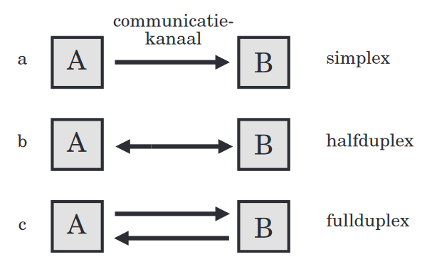

### Serieel en parallel

`Communicatieprotocol`:
Een aantal afspraken over hoe systemen met elkaar kunnen communiceren.
Deze protocollen worden geïmplementeerd in software.

`Parallel`:
De bits worden tegelijkertijd/naast elkaar verzonden.

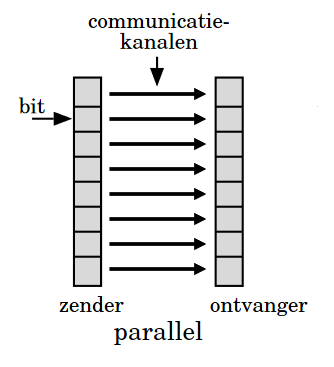

`Serieel`:
De bits worden na elkaar verzonden.

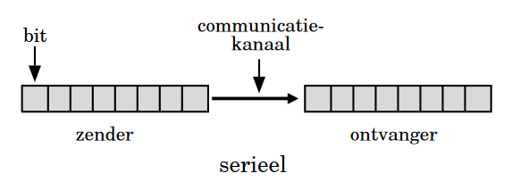

### Efficientie, kanaalcapaciteit en bandbreedte

`bps`:
Het totaal aantal bits dat per seconde verzonden wordt, inclusief protocoloverhead.

`Efficiëntie`:
De verhouding databits tegenover het totaal aantal verzonden bits.

`Throughput`:
Het totaal aantal databits dat per seconde wordt verzonden.

Soms heeft een transportmedium bepaalde elektrische eigenschappen waardoor niet alle frequenties gebruikt kunnen worden voor communicatie.

`Bandbreedte`:
Het frequentiegebied dat mogelijk

`Kanaalcapaciteit`:
De kanaalcapaciteit is het aantal bits dat per seconde (bps) over een kanaal verzonden kan worden.
Deze hoeveelheid kan berekend worden met de wet van shannon:

$$
C = B \log_2{(1 +{ S \over N})}
$$
Waarin:  
$C$: De kanaalcapaciteit  
$B$: De bandbreedte  
$S \over N$: De signaal-ruisverhouding

### Transportmedia

Er zijn 3 mogelijkheden voor datatransport:

- Galvanisch (elektrisch)
- Glasvezel
- Draadloos

ER zijn verschillende galvanische kabels:

- **Coaxkabel**: Geleidende kern, isolatielaag, geleidende mantel, isolerende mantel.

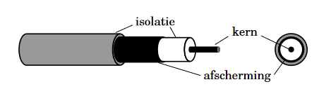

- **Unshielded Twisted Pair (UTP)**: Twee geisoleerde geleidende kernen zijn om elkaar heen gedraaid.
Een UTP-kabel heeft meestal meerdere getwiste paren.

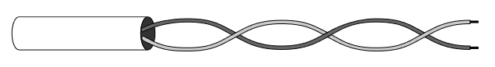

- **Shielded Twisted Pair (STP)**: Net als UTP, maar elk pair zit nu een geleidende mantel om het pair heen, vergelijkbaar met Coax.

Er zijn ook glasvezel kabels.  
Glasvezel kabels geleiden licht.
Een glasvezelkabel bestaat uit een kern, die van heel zuiver glas is gemaakt.
Om de kern zit een laag van minder zuiver glas.
Deze laag heet "cladding".
Doordat de kern en de cladding een andere zuiverheid hebben, hebben ze ook een andere brekingsindex.
Door de andere brekingsindex blijft het licht in de core.
Om de cladding zit ook nog een coating.

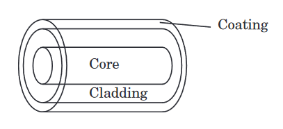

Er zijn een aantal belangrijke voordelen van glasvezel over glavanisch:

- Er treed weinig verzwakking op van het signaal, dus je hebt een groter bereik.
- Met glasvezel heb je een heel grote bandbreedte, dus je kan hogere snelheden (bps) bereiken
- Een signaal over glasvezel is moeilijker af te tappen doordat er geen electromagnetische lekken zijn. Het signaal is dus veiliger

`Multimode fiber`: De kern is wat dikker en wordt aangestuurd met een LED. Het bereik is kleiner.  
`Singlemode fiber`: De kern is wat dunner en wordt aangestuurd met een laser. Het bereik is groter.

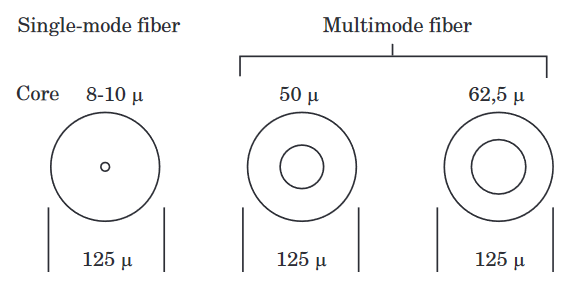

### Serieel datatransport

`Synchroon datatransport`:
Bij synchroon datatransport worden bits met een vaste kloksnelheid verzonden.
Bij synchrone communicatie wordt het kloksignaal geregenereerd aan de kant van de ontvanger.
Het kloksignaal wordt niet over een aparte lijn verzonden.
Er is dus een schakeling nodig die van de datalijn het kloksignaal kan regenereren, die dan door het schuifregister van de ontvanger gebruikt kan worden.
Als er geen data verstuurt wordt, word er een vast bitpatroon verstuurd, die synchronisatie-characters worden genoemd.

Een voorbeeld is de phase locked loop(PLL).
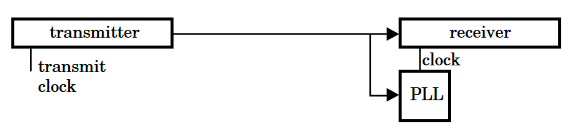

`Tijdelijk synchroon datatransport`:
Er is bij tijdelijk synchroon datatransport nu stilte mogelijk.
De ontvanger regenereerd het kloksignaal door een zoganaamde "leading pad" (ook wel preamble genoemd).
Door voor de databits een leading pad te verzenden wordt het kloksingaal opnieuw gegenereerd.
Een belangrijk verschil is in het feit dat er hier een afspraak is gemaakt over de kloksnelheid, maar de leading pad wordt gebruikt om kleine veranderingen te corrigeren.  
Stappenplan:  

1. Afspraak over kloksnelheid wordt van te voren gemaakt
2. Leading pad wordt verzonden
3. Ontvanger corrigeerd het kloksignaal
4. Verzender stuurt de databits

`Asynchroon datatransport`:
Bij asynchroon datatransport wordt wel gesynchroniseerd, maar er is geen sprake van een kloksignaal.
Van te voren word er een communicatiesnelheid afgesproken.
Dit wordt soms de "baudrate genoemt".
Bij een negatieve flank wordt de "startbit" gesignaleerd.
De startbit is dus altijd 0.
Daarna volgen de databits.
Dit zijn er meestal rond de 8.
Na de databits volgt soms de "pariteitsbit", om de integriteit van de data te checken.
Daarna volgen 1 of 2 stopbits, die altijd 1 zijn, om de startbit weer te kunnen onderscheiden.  
Bij de neerflank van de startbit begint de ontvangersklok (trigger).
Deze heeft meestal een snelheid heeft van 16 keer de baudrate.
Na 8 klokpulsen (ticks) wordt de eerste bit uitgelezen.
Daarna word na elke 16 ticks de volgende bit uitgelezen, totdat de 2 stopbits voorbij zijn.
Een voorbeeld hiervan is UART.  
Hieronder schematisch weergegeven:

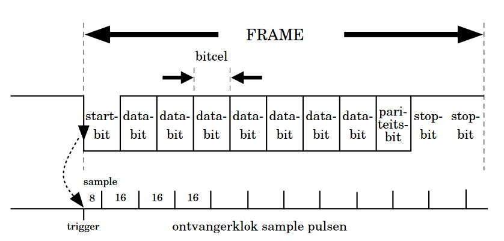

### Parallel datatransport

`Handshake mechanisme`:
Bij parallel datatransport wordt vaak het handshake-mechanisme gebruikt.  
Hier een stappenplan van hoe dat in zijn werk gaat:  

1. Databits worden verstuurd, samen met het REQ signaal.
2. Als de databits goed ontvangen zijn, geeft de ontvanger het ACK signaal.
3. Als de verstuurder het ACK signaal van de ontvanger krijgt, wordt de volgende reeks bits verzonden.
4. Repeat

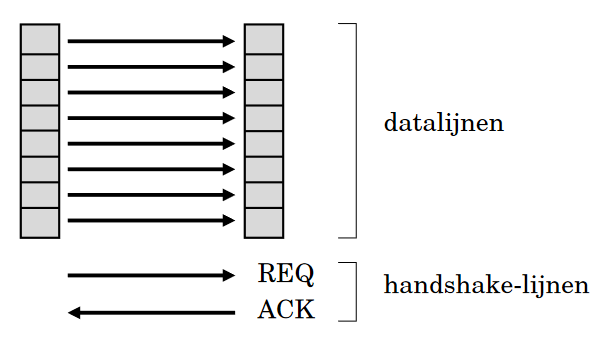
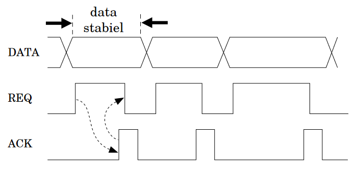

### Modulatie

`Draaggolf`:
Een signaal waaraan veranderingen gemaakt worden om bits er in te kunnen coderen.
Er word zo een nieuw signaal gevormt met data erin gecodeerd.
Meestal weergegeven als een sinusgolf.

`Modulator`:
Standaard is digitale data niet makkelijk over transportmedia te verzenden.
Daarom bestaan er een modulator.
Een modulator is een apparaat dat digitale data omzet in een vorm die over een transportmedium verzonden kan worden.
De bits worden gecodeerd als veranderingen van een draaggolf.

`Demodulator`:
Een demodulator is er om het gemoduleerde signaal de decoderen en de veranderingen aan het draaggolf weer om te zetten in digitale data.

`Modem`:
Een combinatie van een modulator en een demodulator.
Modem is een combinatie van modulator-demodulator.

Er zijn 3 vorment van modulatie:  

- **AM** (Amplitudemodulatie):  
De amplitude van het draaggolf word veranderd om een bit de coderen.
- **FM** (Frequentiemodulatie):
Een of meerdere freqenties worden gebruikt om bits te coderen.
- **PM** (Phase modulation / fasemodulatie):
De fase van de draaggolf wordt veranderd om bits te coderen.
Het lijkt alsof het signaal is opgeschoven in in de tijd.

### Kernel en device drivers

Een OS bestaat uit een hardware afhankelijk en een hardware onafhankelijk deel.

`Kernel`:
Het hardwareonafhankelijke deel van een OS is een kernel.

`Device drivers`:
Stukken software die door de Kernel gebruikt worden om het de hardware te communiceren.
De device drivers zijn gekoppeld aan de hardware, en zijn dus hardwareafhankelijk.

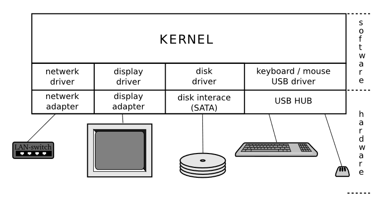

### Proces

`Proces`:
Een proces is een programma dat uitgevoerd wordt.
Een proces ontstaat bij het starten van een programma en verdwijnt als het programma klaar is.
Een process begint meestal als programma dat in een hogere programmeertaal geschreven is.  
Een proces bestaat uit verschillende delen:  

- **codesegment**:
De machinecode/processorinstructies van het programma.
Deze zijn meestal in een hogere programmeertaal zoals C of Java geschreven.
- **datasegment**:
Het deel van het geheugen waar alle gegevens in staan die het programma nodig heeft.
- **stacksegment**:
Een stuk geheugen dat gereserveerd is voor de stack.
Hier wijst de stack pointer naartoe

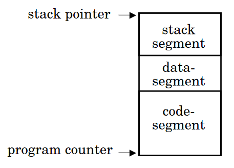

`System call`:
Een proces doen een aanrout aan het OS, om een taak uit te voeren die het proces zelf niet kan of mag.
Het OS bied de mogelijkheid om deze taken uit te voeren voor een proces.
Een system call is een *software interrupt* die een speciale routine oproept uit het OS om een bepaalde taak gedaan te krijgen.
Zo hoeft een user process geen kennis te hebben van de hardware.

- **creat** maakt een nieuwe file
- **open** opent een nieuwe file
- **close** sluit een file
- **pipe** vormt een FIFO (first-in, first-out) communicatiekanaal tussen twee processen
- **fork** maakt een nieuw proces
- **kill** stuurt een signaal naar een proces

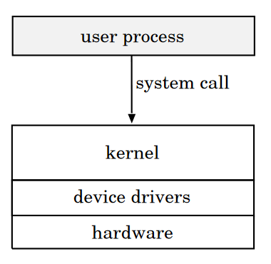

### Command interpreter

`Command interpreter`:
Een comamnd interpreter is een programma waarmee je via een toetsenbord commando's kan geven aan het OS.
Het functioneerd als een "laag" tussen de gebruiker en het OS.
In Unix heeft dit de naam *Shell*.
Een gebruiker kan via een shell een programma/proces starten.
De shell is pas weer beschikbaar nadat het proces klaar is.

`CLI`:
Command Line Interface.
Naam van het communiceren met een shell via toetsenbord.
De shell gebruikt system calls om de tekst van het toetsenbord uit te lezen.

`GUI`:
Graphical User Interface.
Een GUI is een schil je via muis of touchscreen kan communiceren.

### Procesmanagement

`Signle-tasking OS`:
Een OS dat maar proces tegelijkertijd kan uitvoer.
Het voert de processen na elkaar uit.

`Multi-tasking OS`:
Een OS dat meerdere processen schijnbaar tegelijkertijd kan uitvoeren.
Er is echter maar 1 proces tegelijkertijd actief.
De CPU wisselt steeds van proces zodat het lijkt alsof de CPU meerdere processen tegelijkertijd aant het uitvoeren is.

`Procestoestand`:
Bij een multitasking OS kunnen processen zich in meerdere toestanden bevinden.
Zo word elk proces bijgehouden.  
Staten waarin een proces zich kan bevinden:

- **Running**:
het proces wordt uitgevoerd. Dit is er meestal 1 in een single-core CPU.
- **Ready to run**:
het proces kan door de CPU worden uitgevoerd, maar wordt momenteel niet uitgevoerd.
- **Waiting**:
Het proces kan niet verder omdat het op een gebeurtenis (event) wacht.
Een event kan bijvoorbeeld toetsenbord invoer zijn.

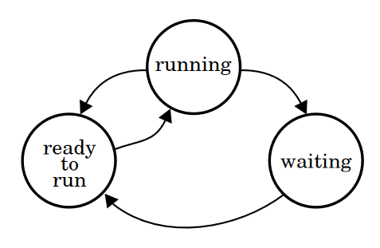

`Process table`:
Een precess table is een tabel waarin o.a. de staat van een proces beijgehouden wordt.

`Scheduler`:
De scheduler is een deel van de kernel dat een nieuw proces kiest om op ready to run te zetten.
Het kiest dus welke processen er zullen worden uitgevoerd

Er zijn onderscheidingen te maken tussen verschillende soorten schedulers:

`Pre-emptive scheduler`:
Bij een pre-emptive scheduler wordt een hardwaretimer aangemaakt, die na een bepaalde tijd (timeslice) een hardware interrupt geeft.
Deze interrupt wordt door de kernel/scheduler afgehandeld.
De scheduler kiest dan een nieuw proces, waarmee het proces herhaald wordt.
Elk proces krijgt dus steeds een timeslice zodat het de CPU kan gebruiken.
Een proces kan dus nooit alle CPU-tijd voor zichzelf nemen, maar wordt afgewisseld.

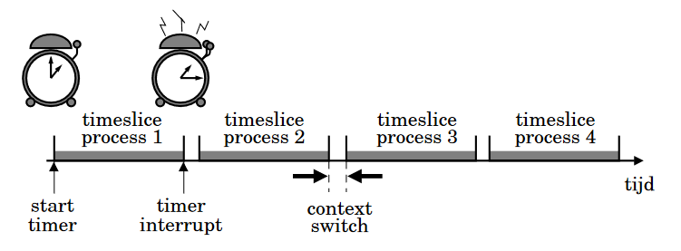

`Blocking system call`:
Een blocking system call wordt gebruikt als een proces op input aan het wachten is, bijvoorbeeld een toetsslag.
Door een system blocking call te geven, gaat de CPU door met een ander proces, zodat er niet onnodig CPU tijd besteed wordt aan het wachten.

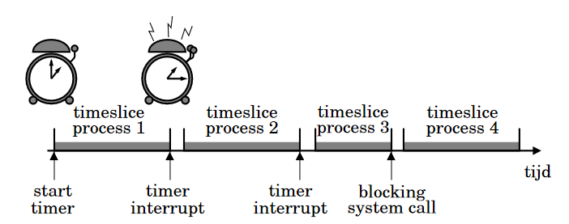

`Non-pre-emptove scheduler`:
Bij een non-pre-emptive scheduler wordt de controle over de CPU aan het proces overgelaten.
De programmeur moet dus zorgen dat het proces de CPU niet te lang in bezit neemt.
Het kan zijn dat een programma in een oneindige lus komt, dan kan alleen eer reset het systeem weer rechtzetten.

`Next-process system call`:
Bij een non-pre-emptive scheduler moet het proces een next-process system call geven.
De CPU stopt dan met het uitvoeren van het huidige proces, en de scheduler kiest dan een nieuw proces voor de CPU om uit te voeren.

### Memory management

Als je code compileerd, zitten er meestal verwijzingen naar geheugenadressen in.
Deze geheugenadressn staat echter vast in de code, dus om een programma goed te laten functioneren, zou het programma eerst naar de goede plek gekopieer moeten worden.
Dit is te tijdrovend en er is een oplossing voor.

`Relocatable code`:
Je kan code compileren zodat het plaatsonafhankelijk is.
Elke aanroep van subroutines wordt nu gedaan ten opzichte van de huidige waarde van de program counter.
De sprongen zijn dus relatief en niet absoluut.
Dit heet relocataable code.

`MMU`:
Memory Management Unit.  
De MMU zit tussen de adresbus en de CPU.
De MMU vertaald de virtuele geheugenadressen (in de CPU) naar fysieke geheugenadressen (in RAM).
Het programmeren van de MMU wordt door de CPU en het OS gedaan, niet door de gebruiker.
Bij het starten van een nieuw proces wordt er een vrij stuk RAM gezocht.
Op die plek wordt de code geladen.
De CPU zegt tegen de MMU waar de code fysiek (in RAM) staat, en waar virtueel (processorinstructies) staat.
Zo kan de MMU de virtuele geheugenadressen vertalen naar fysieke geheugenadressen.

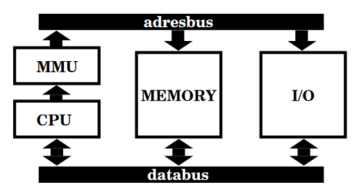

Hier een voorbeeld van hoe het geheugen er per proces uitziet voor de CPU:

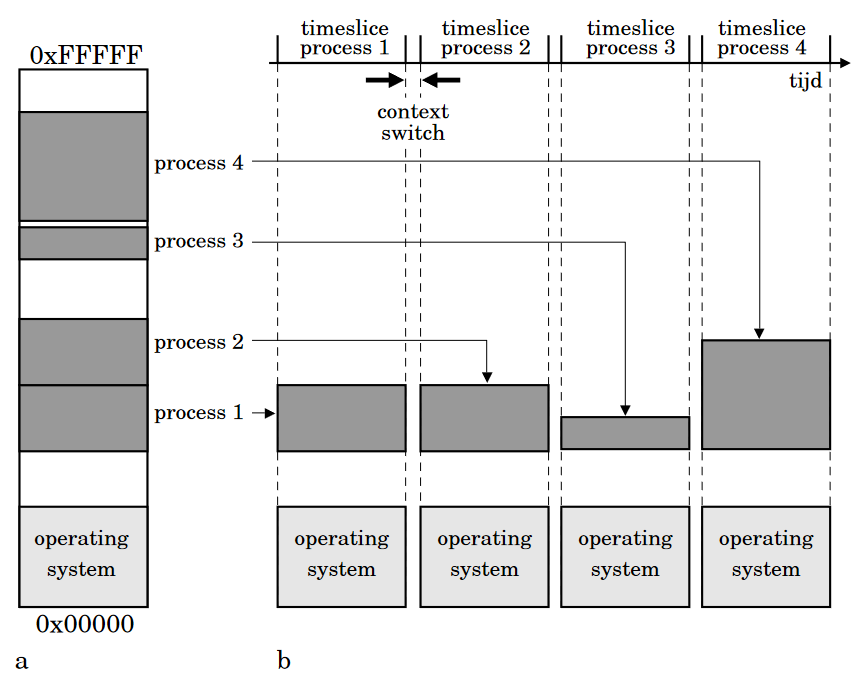

### User en Kernel mode

`User mode/protected mode`:
User mode limiteerd de acties die een gebruiker kan uitvoeren om de CPU.
Een voorbeeld is dat user mode voorkomt dat de gebruiker zelf de MMU kan programmeren.
User processen draaien altijd in user mode.
Een proces in user mode moet een system call doen om speciale instructies te kunnen gebruiken.
Een system call wordt dan uitgevoerd door de kernel, en het proces kan de uitvoering hiervan niet meer beinvloeden.

`Kernel mode/supervisory mode`:
Het OS draait in kernel mode.
System calls vanuit een user process in user mode worden door de kernel in kernel mode uitgevoerd.
De kernel kijkt ook of het user process wel toegestaan is deze system call te doen (mag het proces een bepaalde file wel openen?).
De CPU kan niet zomaar in kernel mode komen vanuit user mode.
Als de CPU in user mode staat, kan een interrupt (hardware en software) de CPU weer in kernel mode brengen.
De ISR die met de interrupt aangeroepen wordt is deel van het OS, dus een gebruiker kan niet zomaar door en interrupt te genereren de CPU in kernel mode brengen.

### Procesmanagement bij beperkt geheugen

Als het geheugen van een systeem met multi-tasking OS vol raakt zijn er verschillende oplossingen:  

- OS laat geen nieuwe processen meer toe. Simpel maar onelegant.
- Van inactieve (wachtend op IO) processen wordt de code tijdelijk naar disk.
Het vrijegemaakte geheugen wordt gebruikt voor het nieuwe proces.
Performance gaat achteruit.
Processen die IO gebruiken kunnen veel trager worden.
- MMU die gebruik maakt van demand paging.

`Demand paging`:
Stukjes van een proces worden opgedeeld in "pages".
Een page kan even groot zijn als een diskblok (512 bytes), maar kan ook een andere grootte zijn (4096 bytes is gebruikelijk).
Als er geen ruimte meer is op RAM, worden er 1 of meerder pages weggeschreven, in plaats van een heel proces.
In de vrije page/pages wordt nu de page van een nieuw proces geschreven.
Als de CPU uit de page wordt, wordt door de MMU het "page trap" signaal gegeven om aan te geven dat de CPU in kernel mode moet gaan en de nieuwe page geladen moet worden.
De adressen van de pages worden zo vertaald dat het voor de CPU lijkt alsof de memory adressen elkaar opvolgen.  
Demand paging heeft een aantal voordelen:

- Er hoeven geen hele processen weggeschreven te worden
- Code voor uitzonderlijke situaties (error handlers) worden niet in RAM geladen. Er is dus een snelheidswinst
- Het is mogelijk om processen die niet helemaal in het werkgeheugen passen, toch helemaal uit te voeren.
- Er hoeft geen aaneensluitend stuk geheugen gevonden te worden.

Er zijn ook een aantal nadelen:

- De MMU moet veel geavanceerder zijn om een pagingsysteem te kunnen gebruiken. De meeste moderne CPU hebben echter wel een geschikte MMU hiervoor
- De CPU moet erop gedesigned zijn. De meeste CPU zijn de echter wel.
- De snelheid van een proces hangt van veel externe facotren af (hoeveel processen zijn er, hoeveel geheugen beschikbaar), waardoor de snelheid onvoorspelbaar is.

Demand paging wordt ook wel "virtueel geheugen" genoemd, omdat het lijkt alsof er meer geheugen is dan fysiek aanwezig.
Bij de timeslice van een proces worden alle pages voor de CPU gezien naast elkaar gezet.
Voor elke page is er een aparte vertaalslag.
Bij een nieuwe timeslice wordt het proces herhaald voor een ander proces.

`Swapping device`:
Een gedeelte van een schijf waarnaartoe pages weggeschreven kunnen worden.

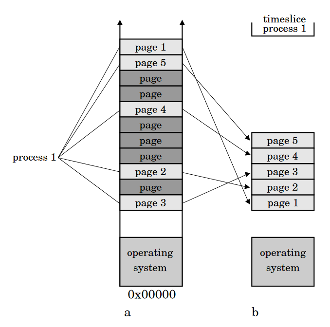
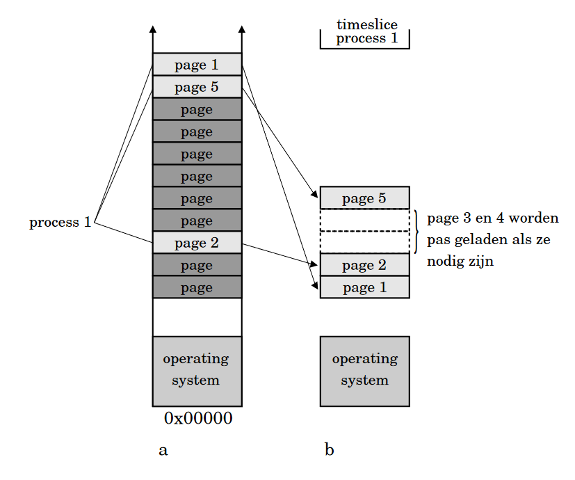

### Threads

Een thread is als een deel van een proces te zien.
Het is een reeks opvolgende processorinstructies door een programma heen.
Threads kunnen parallel uitgevoerd worden, doordat de processorinstructie van 2 threads elkaar niet opvolgen.
De scheduler geeft aan elke thread een timeslice.
Threads zijn niet elk een apart proces; ze opereren dus onder dezelfde context.
Dit betekend dat de MMU niet de pages moet ordenen voor een andere thread, omdat de threads deel zijn van hetzelfde proces

### ARM en embedded systemen

Embebedded systemen kunnen in verschillende klassen van integratie onderscheiden worden:

1. **Microprocessor**:
Kan complex zijn, maar heeft nog geen RAM en IO.
2. **Microcontroller**:
Een processor met RAM en IO op een chip.
3. **SoC**:
Een System on Chip (SoC) heeft RAM, IO en eigen logica.
Deze eigen logica is wordt voor een bepaald doel gebruikt.
Er zijn 2 verschillende uitvoeringen mogelijk voor eigen logica:  
`ASCIC`:
Application Specific Integrated Circuit.
De logica is voor een bepaald doel in te zetten.  
`FPGA`:
Field Programmable Gate Array.
De logica is programmeerbaar en kan voor verschillende doeleinden gebruikt worden.
4. Een of meerdere processorkernen met FPFA.  
`FPFA`: Field Programmable Funtion array.

`RISC`:
Reduced Instruction Set Computer.
Een processorarchitectuur waarin minder instructies gebruikt kunnen worden dan bijvoorbeeld een desktop CPU.

`ARM`:
Advanced RISC Machine.
Een heel energieefficiente RISC processor.
Een ARM kan big-endian of little-endian werken.  
De ARM heeft een aantal Modes:

- **User mode**: De normale mode waarin procesen uitgevoerd worden.
- **FIQ (Fast Interrupt Request)**: De mode waarin de CPU komt na een fast interrupt.
- **IRQ (Interrupt Request)**: De mode waarin de CPU komt na een interrupt.
- **Supervisor mode**: De mode waarin de CPU komt na een reset of software interrupt. Met deze mode kunnen system calls geimplementeerd worden.
- **Abort mode**: Mode voor als geheugentoegang niet succesvol is
- **Undef mode**: Mode voor onbekende instructies.
- **System mode**: Een mode tussen User en Supervisory mode in.

`CPSR`:
De ARM heeft een Current Program Status Register, waarvan de hooste 4 bits status flags zijn.

`Thumb instructieset`:
Een kleinere instructieset van 16 bits tegenover de normale ARM instructieset van 32 bits.
Dit kan een besparing in geheugen opleveren en performance verbeteren.

`Jazelle instructieset`:
Jazelle is een instructieset waarmee Java code uitgevoerd worden.

## Eindopdracht

### Een korte beschrijving van het project

Er was keuze uit 3 verschillende eindopdrachten; Led Choreografie, Pong en Weerstation.
Ik heb pong gekozen.
De opdracht was om een spel te maken dat een beetje lijkt op pong.
Over de 10 leds van de LEDbar beweegt heen en weer een oplichtende led.
Als de led aan het eind is van zijn cyclus, gaat er een led aan.
Dit signaleerd het moment om op de knop te drukken.
Als je te laat of te vroeg bent wordt er een punt van je levens afgetrokken.
Je hebt in totaal 5 levens.
Het spel wordt steeds moeilijker.
De score van van de speler wordt weergegeven op een 7-segment display.
De speler kan voor het spel begint zijn naam invoeren in een seriële monitor.
Als alle levens op zijn, stopt het spel en kan een nieuwe speler zijn naam invoeren.

### Instructies

Hieronder volgt een korte lijst met instructies om het spel te spelen:

1. Open een seriële monitor op voor de esp met een baudrate van 115200
2. Voer je naam in via het toetsenbord en druk op ENTER als je klaar bent.
3. Druk op de knop om het spel te starten.
4. Wacht tot dat de groene led naast de LEDbar aan gaat. Wanneer de led op groen gaat druk je op de knop. Als je te laat of te vroeg klikt, verlies je een leven.
5. Het spel wordt steeds moeilijker, dus blijf spelen totdat je levens op zijn en probeer een highscore te krijgen!

### Hoe het werkt

[Het programma](./pong/src/main.c)

Seven-segment display:
Op de 7 segment display is de huidige score van de speler te laten zien.
Met de SevSeg library (origineel door Dean Reading en geupdate door Mats Otten om te werken met ESP-IDF) set je de score elke loop op het display met de functie `sevseg_setNumber()`.

UART:
Met UART wordt de naam van de speler ingevoerd.
Als basis heb ik hetzelfde code fragment als in de week 4 opdarcht [stoplicht-improved](../week4/README.md#hoe-werkt-het).
Het volgende stukje code is om de UART interface te configureren:

```c
uart_config_t uart_config = {
        .baud_rate = 115200,
        .data_bits = UART_DATA_8_BITS,
        .parity    = UART_PARITY_DISABLE,
        .stop_bits = UART_STOP_BITS_1,
        .flow_ctrl = UART_HW_FLOWCTRL_DISABLE
};
uart_driver_install(UART_NUM_0, BUF_SIZE * 2, 0, 0, NULL, 0);
uart_param_config(UART_NUM_0, &uart_config);
uart_set_pin(UART_NUM_0, UART_PIN_NO_CHANGE, UART_PIN_NO_CHANGE, UART_PIN_NO_CHANGE, UART_PIN_NO_CHANGE);
```

Om elke ingevoerde letter op te slaan, wordt een `char[] nameUser` aangemaakt.
In de functie `getName()` wordt de naam opgesplagen in `nameUser`.

```c
void get_name() {
    uint8_t *data = (uint8_t *) malloc(BUF_SIZE);
    int index = 0;
    bool nameIsComplete;
    nameIsComplete = false;
    printf("Please enter your name (press ENTER to submit):\n");
    while (!nameIsComplete) {
        int len = uart_read_bytes(UART_NUM_0, data, (BUF_SIZE - 1), 20 / portTICK_PERIOD_MS);
        if (len) {
            data[len] = '\0';
            if (data[0] == '\r' || data[0] == '\n')
            {
                nameIsComplete = true;
                nameUser[index] = '\0';
            }
            else
            {
                nameUser[index] = data[0];
            }
            printf("%s\r", data);
            index++;
        }
    }
    printf("Now press the button to start\n");
}
```

In een while-loop wordt gecheckt of er data in de buffer staat.
De als het eerste karakter in de buffer een carriage return `\r` of newline `\n` is, dan stopt de functie met checken voor nieuwe input en wordt aan het einde een null character `\0` geplaatst.
Dit word ook wel "null terminated" genoemd.
Dit wordt gezien als goede gewoonte, omdat dit buffer-overflow overkomt ([bron](https://wiki.sei.cmu.edu/confluence/display/c/STR32-C.+Do+not+pass+a+non-null-terminated+character+sequence+to+a+library+function+that+expects+a+string)).
Nog een rede om dit te doen is omdat sommige functies dit niet automatisch doen.

`updateLives()`:
Deze functie zorgt dat de 5 gekleurde LEDs het aantal levens weergeeft.
In een for-loop wordt gecheckt of het aantal levens `lives` groter is dan `i` (de positie van de led).
Als daar true uit komt dat gaat die specifieke led aan, anders uit.

`updateLedbar()`:
Deze functie zorgt dat de LEDs in de LEDbar geupdate worden.
In deze functie wordt een "cursor" deze wordt met bit-shifting verschoven.
De cursor is 1 bit de steeds verschuift.
Net als in de functie `updateLives()` worden elke pins aan of uitgezet op basis van een for-loop.

`validClick()`:
Deze functie checkt of de knop op het juiste moment wordt ingedrukt. Als het het juiste moment is om te klikken, dan gaat er een led aan.
In een for-loop wordt de cursor vergeleken met de "zone" `zoneSize`.c

`gameloop()`:
Deze functie is het hart van het spel.
Hierin wordt geregeld dat de het "balletje" heen en weer gaat.

### Schematisch en Fysiek


### Bronnen

- [7 Segment Display uitleg en library](https://dlo.mijnhva.nl/d2l/le/content/467515/Home?itemIdentifier=D2L.LE.Content.ContentObject.ModuleCO-1453353)
- [Artikel over 7-segment displays](https://www.electronics-tutorials.ws/blog/7-segment-display-tutorial.html)
- [Strings in C](https://www.w3schools.com/c/c_strings.php)
- [UART voorbeeld en uitleg DLO](https://dlo.mijnhva.nl/d2l/le/content/467515/Home?itemIdentifier=TOC)
- [ESP-IDF Uart programming guide](https://docs.espressif.com/projects/esp-idf/en/latest/esp32s3/api-reference/peripherals/uart.html)
- [Null terminated strings](https://wiki.sei.cmu.edu/confluence/display/c/STR32-C.+Do+not+pass+a+non-null-terminated+character+sequence+to+a+library+function+that+expects+a+string)
